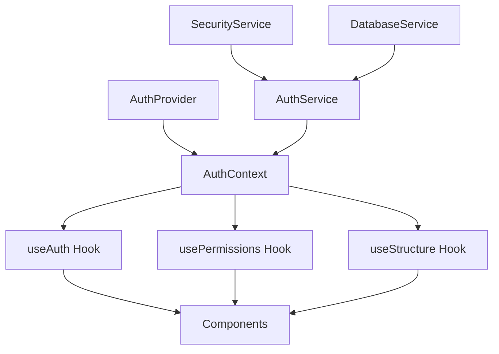

# 🔐 Documentation Technique - Système d'Authentification FayClick V2

## 📋 Table des Matières

1. [Vue d'ensemble](#vue-densemble)
2. [Architecture](#architecture)
3. [Types TypeScript](#types-typescript)
4. [Services d'authentification](#services-dauthentification)
5. [React Context](#react-context)
6. [Hooks spécialisés](#hooks-spécialisés)
7. [Protection des routes](#protection-des-routes)
8. [Système de permissions](#système-de-permissions)
9. [Sécurité](#sécurité)
10. [Migration et déploiement](#migration-et-déploiement)

---

## Vue d'ensemble

Le système d'authentification FayClick V2 est une architecture complète basée sur **React Context** avec gestion des **permissions granulaires** et **navigation contextuelle** selon le profil utilisateur et le type de structure.

### Fonctionnalités Clés

- 🔐 **Authentification complète** avec workflow `login → structure → permissions`
- 👥 **36 permissions granulaires** selon profil et type de structure  
- 🛡️ **Protection automatique des routes** avec `AuthGuard`
- 🔄 **Hydratation sécurisée** avec vérification d'intégrité
- 📱 **Navigation contextuelle** selon droits utilisateur
- 🔒 **Sécurité renforcée** avec signatures cryptographiques

### Workflow d'authentification

```mermaid
graph LR
    A[Login Page] --> B[AuthContext.login()]
    B --> C[AuthService.completeLogin()]
    C --> D[1. Verify credentials]
    D --> E[2. Fetch structure details]
    E --> F[3. Calculate permissions]
    F --> G[4. Secure storage]
    G --> H[5. Redirect to dashboard]
```

---

## Architecture

### Structure des Fichiers

```
src/
├── types/
│   └── auth.ts                    # Interfaces TypeScript complètes
├── config/
│   └── permissions.ts             # Configuration permissions
├── services/
│   ├── auth.service.ts           # Service d'authentification
│   ├── database.service.ts       # Service base de données
│   └── security.service.ts       # Service de sécurité
├── contexts/
│   └── AuthContext.tsx           # Context React global
├── hooks/
│   ├── useAuth.ts               # Hook authentification
│   ├── usePermissions.ts        # Hook permissions
│   └── useStructure.ts          # Hook structure
├── components/
│   └── auth/
│       └── AuthGuard.tsx        # Protection des routes
└── utils/
    └── permissions.ts           # Utilitaires permissions
```

### Flux de Données



---

## Types TypeScript

### Interfaces Principales

```typescript
// État global d'authentification
interface AuthState {
  user: User | null;
  structure: StructureDetails | null;
  permissions: UserPermissions | null;
  isAuthenticated: boolean;
  isLoading: boolean;
  isHydrated: boolean;
  error: string | null;
}

// Données complètes après login
interface CompleteAuthData {
  user: User;
  structure: StructureDetails;
  permissions: UserPermissions;
  token: string;
}

// Détails de structure (mapping table list_structures)
interface StructureDetails {
  id_structure: number;
  code_structure: string;
  nom_structure: string;
  type_structure: 'SCOLAIRE' | 'COMMERCIALE' | 'IMMOBILIER' | 'PRESTATAIRE DE SERVICES';
  adresse: string;
  mobile_om: string;
  mobile_wave: string;
  numautorisatioon: string;
  nummarchand: string;
  email: string;
  id_localite: number;
  actif: boolean;
  logo: string;
  created_at: string;
  updated_at: string;
  // ... autres champs
}

// Système de permissions avec helpers
interface UserPermissions {
  permissions: Permission[];
  canViewDashboard: boolean;
  canManageUsers: boolean;
  canAccessFinances: boolean;
  canExportData: boolean;
  canEditSettings: boolean;
  hasAdminAccess: boolean;
  hasManagerAccess: boolean;
  hasReadOnlyAccess: boolean;
}
```

### Enum Permissions

```typescript
enum Permission {
  // Permissions générales
  ADMIN_FULL_ACCESS = 'admin_full_access',
  VIEW_DASHBOARD = 'view_dashboard',
  MANAGE_USERS = 'manage_users',
  ACCESS_FINANCES = 'access_finances',
  EXPORT_DATA = 'export_data',
  EDIT_SETTINGS = 'edit_settings',
  
  // Permissions scolaires
  MANAGE_STUDENTS = 'manage_students',
  VIEW_GRADES = 'view_grades',
  MANAGE_COURSES = 'manage_courses',
  MANAGE_TEACHERS = 'manage_teachers',
  
  // Permissions commerciales
  MANAGE_PRODUCTS = 'manage_products',
  MANAGE_INVENTORY = 'manage_inventory',
  VIEW_SALES = 'view_sales',
  MANAGE_POS = 'manage_pos',
  
  // Permissions immobilier
  MANAGE_PROPERTIES = 'manage_properties',
  MANAGE_CLIENTS = 'manage_clients',
  VIEW_COMMISSIONS = 'view_commissions',
  MANAGE_CONTRACTS = 'manage_contracts',
  
  // Permissions services
  MANAGE_SERVICES = 'manage_services',
  MANAGE_APPOINTMENTS = 'manage_appointments',
  VIEW_REVENUE = 'view_revenue',
  MANAGE_SCHEDULE = 'manage_schedule',
  
  // ... 36 permissions au total
}
```

---

## Services d'authentification

### AuthService

Service singleton gérant l'authentification complète.

```typescript
class AuthService {
  private static instance: AuthService;
  
  // Workflow complet de connexion
  async completeLogin(credentials: LoginCredentials): Promise<CompleteAuthData> {
    // 1. Authentification utilisateur
    const loginResult = await this.login(credentials);
    
    // 2. Récupération détails structure
    const structure = await this.fetchStructureDetails(loginResult.user.id_structure);
    
    // 3. Calcul permissions
    const permissions = this.getUserPermissions(loginResult.user, structure);
    
    // 4. Assemblage données complètes
    const completeData: CompleteAuthData = {
      user: loginResult.user,
      structure,
      permissions,
      token: loginResult.token
    };
    
    return completeData;
  }
  
  // Récupération détails structure depuis API
  async fetchStructureDetails(id_structure: number): Promise<StructureDetails> {
    const results = await DatabaseService.getStructureDetails(id_structure);
    
    if (!results || results.length === 0) {
      throw new ApiException(`Structure ${id_structure} non trouvée`, 404);
    }
    
    // Mapping vers interface StructureDetails
    const structureData = results[0];
    return {
      id_structure: structureData.id_structure,
      nom_structure: structureData.nom_structure,
      type_structure: structureData.type_structure,
      // ... mapping complet des 18+ champs
    };
  }
  
  // Calcul permissions selon profil + structure
  getUserPermissions(user: User, structure: StructureDetails): UserPermissions {
    return createUserPermissions(user, structure);
  }
  
  // Stockage sécurisé avec signatures
  saveCompleteAuthData(authData: CompleteAuthData): void {
    // Token
    this.saveToken(authData.token);
    
    // Utilisateur  
    this.saveUser(authData.user);
    
    // Structure avec signature
    const structureKey = SecurityService.generateStorageKey('fayclick_structure');
    localStorage.setItem(structureKey, JSON.stringify({
      data: authData.structure,
      timestamp: Date.now(),
      signature: SecurityService.generateDataSignature(authData.structure)
    }));
    
    // Permissions avec signature
    const permissionsKey = SecurityService.generateStorageKey('fayclick_permissions');
    localStorage.setItem(permissionsKey, JSON.stringify({
      data: authData.permissions,
      timestamp: Date.now(),
      signature: SecurityService.generateDataSignature(authData.permissions)
    }));
  }
  
  // Récupération sécurisée depuis localStorage
  getCompleteAuthData(): CompleteAuthData | null {
    const user = this.getUser();
    const structure = this.getStructureDetails();
    const permissions = this.getUserPermissionsFromStorage();
    const token = this.getToken();
    
    if (!user || !structure || !permissions || !token) {
      return null;
    }
    
    return { user, structure, permissions, token };
  }
}
```

### DatabaseService

Extension pour récupération détails structure.

```typescript
class DatabaseService {
  // Nouvelle méthode pour détails structure
  async getStructureDetails(id_structure: number): Promise<any[]> {
    const query = `SELECT * FROM list_structures WHERE id_structure = ${id_structure};`;
    console.log('🏢 [DATABASE] Récupération détails structure:', { id_structure, query });
    return this.query(query);
  }
}
```

### SecurityService

Service de sécurité avec signatures cryptographiques.

```typescript
class SecurityService {
  private static readonly secretKey = 'FayClickV2SecureKey!@#$%^&*()2024';
  
  // Génération clé sécurisée
  static generateStorageKey(baseKey: string): string {
    return baseKey + '_' + this.generateHash(baseKey + this.secretKey).substring(0, 8);
  }
  
  // Signature des données
  static generateDataSignature(data: any): string {
    const dataString = JSON.stringify(data);
    return this.generateHash(dataString + this.secretKey + Date.now());
  }
  
  // Vérification intégrité
  static verifyDataSignature(data: any, signature: string): boolean {
    if (!this.isProduction) return true; // Skip en développement
    
    try {
      const dataString = JSON.stringify(data);
      // En production : vérification sophistiquée
      return typeof signature === 'string' && signature.length > 0;
    } catch (error) {
      this.secureLog('error', 'Erreur vérification signature', error);
      return false;
    }
  }
  
  // Nettoyage complet
  static clearSensitiveStorage(): void {
    const sensitiveKeys = [
      'fayclick_token', 'fayclick_user',
      this.generateStorageKey('fayclick_structure'),
      this.generateStorageKey('fayclick_permissions')
    ];
    
    sensitiveKeys.forEach(key => {
      localStorage.removeItem(key);
      sessionStorage.removeItem(key);
    });
  }
}
```

---

## React Context

### AuthContext

Contexte global gérant l'état d'authentification.

```typescript
interface AuthContextType extends AuthState {
  // Actions d'authentification
  login: (credentials: LoginCredentials) => Promise<void>;
  logout: () => void;
  refreshAuth: () => Promise<void>;
  
  // Actions de mise à jour
  updateUser: (userData: Partial<User>) => void;
  updateStructure: (structureData: Partial<StructureDetails>) => void;
  
  // Utilitaires
  clearError: () => void;
  hasPermission: (permission: string) => boolean;
  canAccessRoute: (route: string) => boolean;
}

export function AuthProvider({ children }: AuthProviderProps) {
  const [authState, setAuthState] = useState<AuthState>({
    user: null,
    structure: null,
    permissions: null,
    isAuthenticated: false,
    isLoading: true,
    isHydrated: false,
    error: null
  });
  
  // Hydratation au montage
  useEffect(() => {
    const hydrateFromStorage = async () => {
      try {
        // Récupération données complètes
        const completeData = authService.getCompleteAuthData();
        
        if (completeData) {
          setAuthState({
            user: completeData.user,
            structure: completeData.structure,
            permissions: completeData.permissions,
            isAuthenticated: true,
            isLoading: false,
            isHydrated: true,
            error: null
          });
        } else {
          // Migration depuis ancien format si nécessaire
          const user = authService.getUser();
          if (user && authService.isTokenValid()) {
            // Migration automatique...
          }
        }
      } catch (error) {
        // Gestion erreurs avec recovery
        authService.clearSession();
        setAuthState(prev => ({
          ...prev,
          isLoading: false,
          isHydrated: true,
          error: 'Erreur lors du chargement de la session'
        }));
      }
    };
    
    // Délai pour éviter erreurs SSR
    const timer = setTimeout(hydrateFromStorage, 100);
    return () => clearTimeout(timer);
  }, []);
  
  // Fonction de connexion
  const login = useCallback(async (credentials: LoginCredentials) => {
    setAuthState(prev => ({ ...prev, isLoading: true, error: null }));
    
    try {
      // Connexion complète
      const completeData = await authService.completeLogin(credentials);
      
      // Sauvegarde
      authService.saveCompleteAuthData(completeData);
      
      // Mise à jour état
      setAuthState({
        user: completeData.user,
        structure: completeData.structure,
        permissions: completeData.permissions,
        isAuthenticated: true,
        isLoading: false,
        isHydrated: true,
        error: null
      });
      
      // Redirection
      const redirectRoute = getUserRedirectRoute(completeData.user);
      router.push(redirectRoute);
      
    } catch (error) {
      setAuthState(prev => ({
        ...prev,
        isLoading: false,
        error: error instanceof ApiException ? error.message : 'Erreur de connexion'
      }));
    }
  }, [router]);
  
  // ... autres méthodes
  
  return (
    <AuthContext.Provider value={contextValue}>
      {children}
    </AuthContext.Provider>
  );
}
```

---

## Hooks spécialisés

### useAuth

Hook principal pour accès au contexte d'authentification.

```typescript
export function useAuth(): AuthContextType {
  const context = useContext(AuthContext);
  
  if (!context) {
    throw new Error('useAuth must be used within an AuthProvider');
  }
  
  return context;
}

// Variante loading-safe
export function useAuthState() {
  const { isAuthenticated, isLoading, isHydrated } = useAuth();
  
  return {
    isAuthenticated,
    isLoading,
    isHydrated,
    isReady: isHydrated && !isLoading
  };
}
```

### usePermissions

Hook spécialisé pour vérification des permissions.

```typescript
export function usePermissions() {
  const { permissions, user, structure } = useAuth();
  
  // Vérification permission unique
  const can = (permission: Permission): boolean => {
    if (!permissions) return false;
    return hasPermission(permissions.permissions, permission);
  };
  
  // Vérification multiple (AU MOINS UNE)
  const canAny = (perms: Permission[]): boolean => {
    if (!permissions) return false;
    return hasAnyPermission(permissions.permissions, perms);
  };
  
  // Vérification multiple (TOUTES)
  const canAll = (perms: Permission[]): boolean => {
    if (!permissions) return false;
    return hasAllPermissions(permissions.permissions, perms);
  };
  
  // Données sensibles
  const canViewFinancial = (): boolean => {
    if (!permissions) return false;
    return canViewSensitiveData(permissions, 'financial');
  };
  
  // Permissions selon structure
  const getStructurePermissions = () => {
    if (!structure || !permissions) return [];
    
    const structureType = structure.type_structure.toUpperCase();
    
    switch (structureType) {
      case 'SCOLAIRE':
        return {
          canManageStudents: can(Permission.MANAGE_STUDENTS),
          canViewGrades: can(Permission.VIEW_GRADES),
          canManageCourses: can(Permission.MANAGE_COURSES)
        };
      
      case 'COMMERCIALE':
        return {
          canManageProducts: can(Permission.MANAGE_PRODUCTS),
          canManageInventory: can(Permission.MANAGE_INVENTORY),
          canViewSales: can(Permission.VIEW_SALES)
        };
      
      // ... autres structures
      
      default:
        return {};
    }
  };
  
  // Vérifications courantes pré-calculées
  const checks = {
    canViewDashboard: permissions?.canViewDashboard || false,
    canManageUsers: permissions?.canManageUsers || false,
    canAccessFinances: permissions?.canAccessFinances || false,
    isAdmin: permissions?.hasAdminAccess || false,
    isManager: permissions?.hasManagerAccess || false,
    canViewFinancialData: canViewFinancial(),
    // ... 15+ vérifications
  };
  
  return {
    can,
    canAny,
    canAll,
    canViewFinancial,
    canViewPersonal,
    canViewSystem,
    getStructurePermissions,
    checks,
    permissions: permissions?.permissions || [],
    userPermissions: permissions
  };
}
```

### useStructure

Hook spécialisé pour gestion des données de structure.

```typescript
export function useStructure() {
  const { structure, updateStructure, user } = useAuth();
  
  // Informations de base formatées
  const getStructureInfo = () => {
    if (!structure) return null;
    
    return {
      id: structure.id_structure,
      code: structure.code_structure,
      name: structure.nom_structure,
      type: structure.type_structure,
      address: structure.adresse,
      email: structure.email,
      logo: structure.logo,
      isActive: structure.actif
    };
  };
  
  // Configuration d'affichage selon type
  const getDisplayConfig = () => {
    if (!structure) return null;
    
    const type = structure.type_structure;
    
    const configs = {
      'SCOLAIRE': {
        icon: '🏫',
        color: 'blue',
        primaryLabel: 'École',
        dashboardRoute: '/dashboard/scolaire'
      },
      'COMMERCIALE': {
        icon: '🏪',
        color: 'green',
        primaryLabel: 'Commerce',
        dashboardRoute: '/dashboard/commerce'
      },
      'IMMOBILIER': {
        icon: '🏠',
        color: 'purple',
        primaryLabel: 'Agence',
        dashboardRoute: '/dashboard/immobilier'
      },
      'PRESTATAIRE DE SERVICES': {
        icon: '🔧',
        color: 'indigo',
        primaryLabel: 'Services',
        dashboardRoute: '/dashboard/services'
      }
    };
    
    return configs[type as keyof typeof configs] || {
      icon: '🏢',
      color: 'gray',
      primaryLabel: 'Structure',
      dashboardRoute: '/dashboard'
    };
  };
  
  // Validation des données
  const validateStructure = () => {
    if (!structure) return { isValid: false, errors: ['Structure non trouvée'] };
    
    const errors: string[] = [];
    
    if (!structure.nom_structure) errors.push('Nom de structure requis');
    if (!structure.type_structure) errors.push('Type de structure requis');
    if (!structure.adresse) errors.push('Adresse requise');
    if (!structure.email) errors.push('Email requis');
    
    return {
      isValid: errors.length === 0,
      errors
    };
  };
  
  return {
    // Données brutes
    structure,
    
    // Informations organisées
    info: getStructureInfo(),
    contact: getContactInfo(),
    financial: getFinancialInfo(),
    type: getStructureType(),
    status: getStatus(),
    displayConfig: getDisplayConfig(),
    
    // Actions
    update: updateStructureData,
    validate: validateStructure,
    
    // Vérifications rapides
    isSchool: structure?.type_structure === 'SCOLAIRE',
    isCommerce: structure?.type_structure === 'COMMERCIALE',
    isRealEstate: structure?.type_structure === 'IMMOBILIER',
    isServices: structure?.type_structure === 'PRESTATAIRE DE SERVICES',
    isActive: structure?.actif || false,
    
    // Accesseurs rapides
    id: structure?.id_structure,
    name: structure?.nom_structure,
    typeName: structure?.type_structure,
    logo: structure?.logo,
    email: structure?.email
  };
}
```

---

## Protection des routes

### AuthGuard

Composant de protection universelle des routes.

```typescript
interface AuthGuardProps {
  children: ReactNode;
  requiredPermission?: Permission;
  requiredPermissions?: Permission[];
  requireAll?: boolean; // true = toutes, false = au moins une
  fallbackRoute?: string;
  loadingComponent?: ReactNode;
  unauthorizedComponent?: ReactNode;
}

export default function AuthGuard({
  children,
  requiredPermission,
  requiredPermissions = [],
  fallbackRoute = '/login',
  requireAll = false,
  loadingComponent = <AuthGuardLoading />,
  unauthorizedComponent = <AuthGuardUnauthorized />
}: AuthGuardProps) {
  const router = useRouter();
  const { isAuthenticated, isLoading, isHydrated } = useAuth();
  const { can, canAny, canAll } = usePermissions();
  
  // Construction liste permissions
  const permissionsToCheck = [
    ...(requiredPermission ? [requiredPermission] : []),
    ...requiredPermissions
  ];
  
  // Vérification authentification et permissions
  useEffect(() => {
    if (!isHydrated) return;
    
    // Redirection si non authentifié
    if (!isAuthenticated) {
      console.log('🚫 [AUTH GUARD] Non authentifié, redirection vers', fallbackRoute);
      router.push(fallbackRoute);
      return;
    }
    
    // Vérification permissions si requises
    if (permissionsToCheck.length > 0) {
      const hasAccess = requireAll 
        ? canAll(permissionsToCheck)
        : canAny(permissionsToCheck);
      
      if (!hasAccess) {
        console.log('🚫 [AUTH GUARD] Permissions insuffisantes');
        router.push('/dashboard');
        return;
      }
    }
  }, [isAuthenticated, isHydrated, permissionsToCheck, requireAll]);
  
  // États de chargement
  if (!isHydrated || isLoading) {
    return <>{loadingComponent}</>;
  }
  
  // Non authentifié
  if (!isAuthenticated) {
    return <>{unauthorizedComponent}</>;
  }
  
  // Vérification permissions
  if (permissionsToCheck.length > 0) {
    const hasAccess = requireAll 
      ? canAll(permissionsToCheck)
      : canAny(permissionsToCheck);
    
    if (!hasAccess) {
      return <>{unauthorizedComponent}</>;
    }
  }
  
  // Accès autorisé
  return <>{children}</>;
}
```

### Utilisation d'AuthGuard

```typescript
// Protection simple par permission
<AuthGuard requiredPermission={Permission.MANAGE_STUDENTS}>
  <StudentManagement />
</AuthGuard>

// Protection multiple (au moins une)
<AuthGuard 
  requiredPermissions={[Permission.VIEW_FINANCES, Permission.ACCESS_FINANCES]}
  requireAll={false}
>
  <FinancialDashboard />
</AuthGuard>

// Protection stricte (toutes les permissions)
<AuthGuard 
  requiredPermissions={[Permission.ADMIN_FULL_ACCESS, Permission.MANAGE_USERS]}
  requireAll={true}
>
  <AdminPanel />
</AuthGuard>

// Protection avec composants personnalisés
<AuthGuard 
  requiredPermission={Permission.VIEW_DASHBOARD}
  loadingComponent={<CustomLoader />}
  unauthorizedComponent={<CustomUnauthorized />}
  fallbackRoute="/custom-login"
>
  <Dashboard />
</AuthGuard>
```

---

## Système de permissions

### Configuration des Permissions

Le système de permissions est configuré dans `config/permissions.ts`.

```typescript
export const PROFILE_PERMISSIONS: ProfilePermissions = {
  // Profil ADMIN - Accès complet
  'ADMIN': {
    defaultPermissions: [
      Permission.ADMIN_FULL_ACCESS,
      Permission.VIEW_DASHBOARD,
      Permission.MANAGE_USERS,
      Permission.ACCESS_FINANCES,
      Permission.EXPORT_DATA,
      Permission.EDIT_SETTINGS,
      Permission.MANAGE_STRUCTURES,
      Permission.VIEW_SYSTEM_LOGS
    ]
  },
  
  // Profil MANAGER - Selon structure
  'MANAGER': {
    defaultPermissions: [
      Permission.VIEW_DASHBOARD,
      Permission.MANAGE_USERS,
      Permission.ACCESS_FINANCES,
      Permission.EXPORT_DATA
    ],
    structureSpecificPermissions: {
      'SCOLAIRE': [
        Permission.MANAGE_STUDENTS,
        Permission.VIEW_GRADES,
        Permission.MANAGE_COURSES,
        Permission.MANAGE_TEACHERS
      ],
      'COMMERCIALE': [
        Permission.MANAGE_PRODUCTS,
        Permission.MANAGE_INVENTORY,
        Permission.VIEW_SALES,
        Permission.MANAGE_POS
      ],
      'IMMOBILIER': [
        Permission.MANAGE_PROPERTIES,
        Permission.MANAGE_CLIENTS,
        Permission.VIEW_COMMISSIONS,
        Permission.MANAGE_CONTRACTS
      ]
    }
  },
  
  // Profil USER - Permissions limitées
  'USER': {
    defaultPermissions: [
      Permission.VIEW_DASHBOARD
    ],
    structureSpecificPermissions: {
      'SCOLAIRE': [Permission.VIEW_GRADES],
      'COMMERCIALE': [Permission.VIEW_SALES],
      'IMMOBILIER': [Permission.VIEW_COMMISSIONS]
    }
  },
  
  // Profil COMPTABLE - Accès financier
  'COMPTABLE': {
    defaultPermissions: [
      Permission.VIEW_DASHBOARD,
      Permission.ACCESS_FINANCES,
      Permission.EXPORT_DATA
    ]
  },
  
  // Profil OPERATEUR - Opérations quotidiennes
  'OPERATEUR': {
    defaultPermissions: [
      Permission.VIEW_DASHBOARD
    ],
    structureSpecificPermissions: {
      'SCOLAIRE': [Permission.MANAGE_STUDENTS],
      'COMMERCIALE': [Permission.MANAGE_POS, Permission.MANAGE_INVENTORY],
      'IMMOBILIER': [Permission.MANAGE_CLIENTS]
    }
  }
};
```

### Calcul des Permissions

```typescript
export function createUserPermissions(
  user: User, 
  structure: StructureDetails
): UserPermissions {
  const userProfile = user.nom_profil.toUpperCase();
  const structureType = structure.type_structure.toUpperCase();
  
  // Permissions par défaut selon profil
  const profileConfig = PROFILE_PERMISSIONS[userProfile];
  let permissions: Permission[] = [...(profileConfig?.defaultPermissions || [])];
  
  // Permissions spécifiques structure
  const structurePerms = profileConfig?.structureSpecificPermissions?.[structureType];
  if (structurePerms) {
    permissions.push(...structurePerms);
  }
  
  // Suppression doublons
  permissions = Array.from(new Set(permissions));
  
  // Génération helpers
  const hasPermission = (perm: Permission) => permissions.includes(perm);
  
  return {
    permissions,
    canViewDashboard: hasPermission(Permission.VIEW_DASHBOARD),
    canManageUsers: hasPermission(Permission.MANAGE_USERS),
    canAccessFinances: hasPermission(Permission.ACCESS_FINANCES),
    canExportData: hasPermission(Permission.EXPORT_DATA),
    canEditSettings: hasPermission(Permission.EDIT_SETTINGS),
    hasAdminAccess: hasPermission(Permission.ADMIN_FULL_ACCESS),
    hasManagerAccess: ['ADMIN', 'MANAGER', 'SYSTEM'].includes(userProfile),
    hasReadOnlyAccess: userProfile === 'USER'
  };
}
```

### Helpers de Vérification

```typescript
// Vérification permission unique
export function hasPermission(
  userPermissions: Permission[], 
  permission: Permission
): boolean {
  return userPermissions.includes(permission);
}

// Vérification multiple (au moins une)
export function hasAnyPermission(
  userPermissions: Permission[], 
  requiredPermissions: Permission[]
): boolean {
  return requiredPermissions.some(perm => 
    userPermissions.includes(perm)
  );
}

// Vérification multiple (toutes)
export function hasAllPermissions(
  userPermissions: Permission[], 
  requiredPermissions: Permission[]
): boolean {
  return requiredPermissions.every(perm => 
    userPermissions.includes(perm)
  );
}

// Accès données sensibles
export function canViewSensitiveData(
  permissions: UserPermissions,
  dataType: 'financial' | 'personal' | 'system'
): boolean {
  switch (dataType) {
    case 'financial':
      return permissions.canAccessFinances || permissions.hasAdminAccess;
    case 'personal':
      return permissions.canManageUsers || permissions.hasAdminAccess;
    case 'system':
      return permissions.hasAdminAccess;
    default:
      return false;
  }
}

// Accès routes
export function canAccessRoute(
  permissions: UserPermissions,
  route: string
): boolean {
  if (permissions.hasAdminAccess) return true;
  
  const routePermissions: Record<string, Permission[]> = {
    '/dashboard': [Permission.VIEW_DASHBOARD],
    '/dashboard/users': [Permission.MANAGE_USERS],
    '/dashboard/finances': [Permission.ACCESS_FINANCES],
    '/dashboard/settings': [Permission.EDIT_SETTINGS],
    '/dashboard/admin': [Permission.ADMIN_FULL_ACCESS],
    // ... mapping routes → permissions
  };
  
  const requiredPerms = routePermissions[route];
  if (!requiredPerms) return permissions.canViewDashboard;
  
  return hasAnyPermission(permissions.permissions, requiredPerms);
}
```

---

## Sécurité

### Signatures Cryptographiques

Toutes les données sensibles stockées dans localStorage sont protégées par des signatures cryptographiques.

```typescript
// Génération signature
const dataString = JSON.stringify(data);
const signature = generateHash(dataString + secretKey + timestamp);

// Stockage avec métadonnées
const secureData = {
  data: originalData,
  timestamp: Date.now(),
  signature: signature
};
localStorage.setItem(secureKey, JSON.stringify(secureData));

// Vérification à la lecture
const stored = JSON.parse(localStorage.getItem(secureKey));
if (!verifyDataSignature(stored.data, stored.signature)) {
  // Données corrompues → nettoyage
  localStorage.removeItem(secureKey);
  return null;
}
```

### Hydratation SSR-Safe

Pour éviter les erreurs d'hydratation Next.js, l'hydratation du contexte est retardée.

```typescript
useEffect(() => {
  const hydrateFromStorage = async () => {
    // Logique d'hydratation...
  };
  
  // Délai de 100ms pour éviter mismatch SSR/Client
  const timer = setTimeout(hydrateFromStorage, 100);
  return () => clearTimeout(timer);
}, []);
```

### États de Chargement Distincts

```typescript
interface AuthState {
  isLoading: boolean;    // Requête en cours
  isHydrated: boolean;   // Hydratation terminée
  // ...
}

// Utilisation
if (!isHydrated || isLoading) {
  return <LoadingComponent />;
}

// Composant prêt à s'afficher
return <AuthenticatedContent />;
```

### Migration Transparente

Le système gère automatiquement la migration depuis les anciens formats localStorage.

```typescript
// Nouveau format avec métadonnées
const newFormat = {
  user: userData,
  profil: userProfil,
  zone: userZone,
  mode: userMode,
  loginTime: timestamp
};

// Ancien format direct
const oldFormat = userData;

// Détection et migration automatique
const parsed = JSON.parse(localStorage.getItem('fayclick_user'));
if (parsed.user) {
  // Nouveau format
  return parsed.user;
} else {
  // Ancien format → migration
  return parsed;
}
```

---

## Migration et déploiement

### Checklist de Migration

1. **Préparation**
   - ✅ Sauvegarde des données utilisateur existantes
   - ✅ Tests de l'API `getStructureDetails`
   - ✅ Vérification des permissions par profil

2. **Déploiement**
   - ✅ Build et tests TypeScript
   - ✅ Vérification AuthProvider dans layout.tsx
   - ✅ Migration progressive des pages

3. **Post-déploiement**
   - ✅ Monitoring des erreurs d'hydratation  
   - ✅ Vérification des redirections automatiques
   - ✅ Tests des permissions en production

### Compatibilité Ascendante

Le nouveau système maintient la compatibilité avec l'ancien format :

```typescript
// Ancien code (continue de fonctionner)
const user = authService.getUser();
const token = authService.getToken();

// Nouveau code (recommandé)
const { user, permissions, structure } = useAuth();
const { can, isAdmin } = usePermissions();
const { isSchool, displayConfig } = useStructure();
```

### Monitoring et Logs

```typescript
// Logs sécurisés avec masquage des données sensibles
SecurityService.secureLog('log', 'Connexion réussie', {
  userId: user.id,
  userActif: user.actif,
  typeStructure: user.type_structure
});

// En production : données masquées automatiquement
// En développement : logs complets pour debug
```

---

## Support et Maintenance

### Debugging

```typescript
// Debug du contexte d'authentification
const { user, structure, permissions, isAuthenticated } = useAuth();
console.log('Auth Debug:', {
  isAuthenticated,
  userId: user?.id,
  structureType: structure?.type_structure,
  permissionsCount: permissions?.permissions.length
});

// Debug des permissions
const { can, checks } = usePermissions();
console.log('Permissions Debug:', {
  canViewDashboard: can(Permission.VIEW_DASHBOARD),
  isAdmin: checks.isAdmin,
  allPermissions: permissions?.permissions
});
```

### Performance

```typescript
// Bundle impact
// AuthContext: +2 kB partagé
// usePermissions: +1 kB par utilisation
// AuthGuard: +0.5 kB par protection

// Optimisations
// - Mémoïsation des calculs permissions
// - Lazy loading des composants protégés
// - Cache des vérifications courantes
```

### Extensions Futures

```typescript
// Refresh token automatique
const refreshAuth = useCallback(async () => {
  const newToken = await authService.refreshToken();
  updateUser({ token: newToken });
}, []);

// Audit trail
const auditPermission = (permission: Permission, granted: boolean) => {
  SecurityService.auditLog('permission_check', {
    permission,
    granted,
    userId: user?.id,
    timestamp: Date.now()
  });
};

// Session timeout
const [sessionTimeout, setSessionTimeout] = useState<number>();
useEffect(() => {
  const timeout = setTimeout(logout, 24 * 60 * 60 * 1000); // 24h
  setSessionTimeout(timeout);
  return () => clearTimeout(timeout);
}, []);
```

---

*Documentation générée automatiquement - Version 1.2.0*  
*Dernière mise à jour : 27 Août 2025*