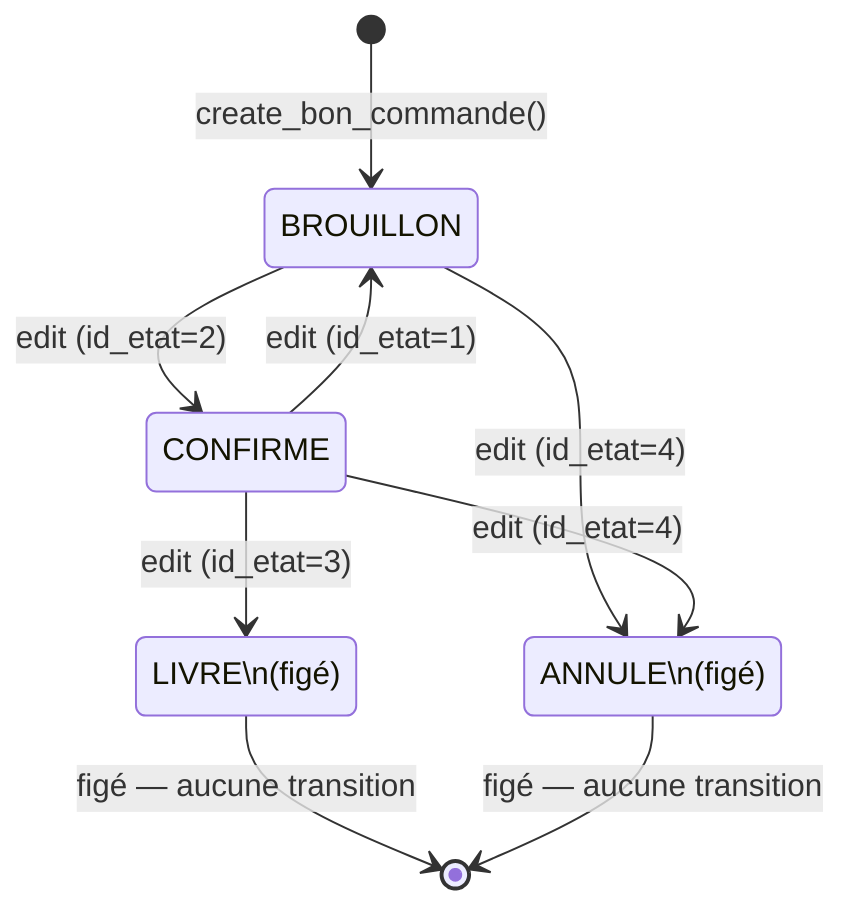

# Schéma BD — Bons de Commande Fournisseurs v1.0 (EPIC 2)

**DBA** : dba_master  
**Date** : 2026-05-25  
**Base** : fayclick_db (154.12.224.173:3253)  
**PRD** : `docs/prd-bons-commande-fournisseurs-2026-05-25.md` (FR-008 à FR-013)  
**SHA-256 schema DDL** : `a38ad7ee94b6616804e6faefdea826fe1669799b184df46a7748d892c4e24e10`  
**Prérequis** : EPIC 1 déployé (`fournisseur-schema.sql` + `fournisseur-functions.sql`)

---

## 1. Vue d'ensemble

Le module Bons de Commande Fournisseurs permet aux structures FayClick (condition : `compte_prive = TRUE`) de gérer leur processus d'approvisionnement de A à Z : création de bons de commande, suivi du cycle de vie (BROUILLON → CONFIRME → LIVRE/ANNULE), et consultation de l'historique.

**Périmètre EPIC 2** : couche base de données uniquement (DDL + fonctions PL/pgSQL). L'interface React Native et les services Node.js sont sous responsabilité de kader_backend.

**Décisions architecturales clés** :
- Aucun mouvement de stock automatique (FR-025 hors scope) — la réception physique reste manuelle via Inventaire
- Snapshot dénormalisé fournisseur + produit à la création (résilience historique)
- Numérotation atomique par structure via table compteur dédiée (Option C, pas `COUNT()+1`)
- Pas de FK stricte sur `bon_commande_details.id_produit` (snapshot historique : un produit supprimé ne casse pas l'historique des BC)

---

## 2. Tables

### 2.1 `bon_commande_compteur`

Table auxiliaire pour la numérotation atomique par structure. Gérée exclusivement par `create_bon_commande()`.

| Colonne | Type | Null | Défaut | Description |
|---|---|---|---|---|
| `id_structure` | INTEGER | NOT NULL | — | PK + FK → structures(id_structure) ON DELETE CASCADE |
| `dernier_seq` | INTEGER | NOT NULL | 0 | Dernier numéro alloué. Incrémenté atomiquement via ON CONFLICT DO UPDATE RETURNING |

**Volumétrie** : 1 ligne par structure utilisant les BC. Taille négligeable.

**Justification Option C vs `COUNT()+1`** : La méthode `COUNT()+1` est sujette aux race conditions sous accès concurrent (deux requêtes simultanées lisent le même COUNT, génèrent le même numéro). L'`INSERT ON CONFLICT DO UPDATE RETURNING` est atomique sans verrou explicite et garantit l'unicité même sous haute concurrence.

---

### 2.2 `bon_commande`

Table principale des bons de commande.

| Colonne | Type | Null | Défaut | Description |
|---|---|---|---|---|
| `id_bon_commande` | SERIAL | NOT NULL | auto | PK auto-incrémentée |
| `id_structure` | INTEGER | NOT NULL | — | FK → structures(id_structure) ON DELETE RESTRICT |
| `id_fournisseur` | INTEGER | NOT NULL | — | FK → fournisseur(id_fournisseur) ON DELETE RESTRICT |
| `id_etat` | INTEGER | NOT NULL | 1 | FK → etat_bon_commande(id_etat). 1=BROUILLON, 2=CONFIRME, 3=LIVRE, 4=ANNULE |
| `num_bc` | VARCHAR(30) | NOT NULL | — | Numéro lisible format BC-{structure}-{YYYYMMDD}-{seq4}. UNIQUE par structure |
| `date_bon_commande` | DATE | NOT NULL | — | Date saisie (peut être rétroactive) |
| `description` | TEXT | NULL | — | Objet/référence libre |
| `montant_net` | NUMERIC(15,2) | NOT NULL | 0 | Montant après remise. CHECK ≥ 0 |
| `mt_remise` | NUMERIC(15,2) | NOT NULL | 0 | Remise accordée. CHECK ≥ 0 |
| `nom_fournisseur_snap` | VARCHAR(200) | NULL | — | Snapshot nom fournisseur au CREATE (immuable) |
| `tel_fournisseur_snap` | VARCHAR(20) | NULL | — | Snapshot téléphone fournisseur au CREATE (immuable) |
| `id_utilisateur` | INTEGER | NOT NULL | 0 | ID utilisateur créateur (audit trail) |
| `date_creation` | TIMESTAMP | NOT NULL | NOW() | Horodatage BD automatique |
| `date_modification` | TIMESTAMP | NULL | — | Mis à jour par edit_bon_commande() |

**Contraintes** :
- `CONSTRAINT chk_bc_montant_net CHECK (montant_net >= 0)`
- `CONSTRAINT chk_bc_remise_positive CHECK (mt_remise >= 0)`
- `CONSTRAINT uq_bc_num_structure UNIQUE (id_structure, num_bc)`
- `FK id_fournisseur ON DELETE RESTRICT` (le fournisseur ne peut pas être supprimé tant que des BC existent)

**Volumétrie estimée** : 50-500 BC/structure/an selon activité. Indexation composite suffisante à l'horizon 3 ans.

---

### 2.3 `bon_commande_details`

Lignes articles d'un BC.

| Colonne | Type | Null | Défaut | Description |
|---|---|---|---|---|
| `id_detail` | SERIAL | NOT NULL | auto | PK |
| `id_bon_commande` | INTEGER | NOT NULL | — | FK → bon_commande(id_bon_commande) ON DELETE CASCADE |
| `id_structure` | INTEGER | NOT NULL | — | Dénormalisé pour filtrage direct sans jointure parent |
| `id_produit` | INTEGER | NOT NULL | — | Référence produit. Pas de FK stricte (snapshot historique) |
| `nom_produit_snap` | VARCHAR(200) | NOT NULL | — | Snapshot nom produit au CREATE (immuable) |
| `quantite` | NUMERIC(10,3) | NOT NULL | — | Quantité commandée. CHECK > 0 |
| `cout_revient` | NUMERIC(15,2) | NOT NULL | — | Prix d'achat unitaire. CHECK ≥ 0 |

**Contraintes** :
- `CONSTRAINT chk_bcd_quantite_pos CHECK (quantite > 0)`
- `CONSTRAINT chk_bcd_cout_pos CHECK (cout_revient >= 0)`
- `CASCADE DELETE` depuis `bon_commande` (suppression BC → suppression automatique des lignes)

**Justification absence FK sur id_produit** : Un produit peut être supprimé du catalogue après la commande. La FK provoquerait alors une erreur sur le DELETE produit. Le snapshot `nom_produit_snap` suffit pour l'affichage historique. L'existence du produit est vérifiée **à la création** (fail-fast), pas ultérieurement.

---

## 3. Index

| Nom | Table | Colonnes | Partiel | Rôle |
|---|---|---|---|---|
| `idx_bc_structure_etat` | bon_commande | (id_structure, id_etat) | Non | Filtre liste par structure et statut |
| `idx_bc_structure_date_desc` | bon_commande | (id_structure, date_creation DESC) | `WHERE id_etat IN (1,2)` | Dashboard BC actifs récents |
| `idx_bc_fournisseur` | bon_commande | (id_fournisseur) | Non | COUNT BC par fournisseur (get_list_fournisseurs patch) |
| `idx_bcd_bon_commande` | bon_commande_details | (id_bon_commande) | Non | Chargement rapide lignes du BC |
| `idx_bcd_structure` | bon_commande_details | (id_structure) | Non | Isolation sécurité requêtes directes sur détails |

---

## 4. Cycle de vie — Matrice des transitions de statut

```
Légende : ✅ autorisé | ❌ refusé
```

| Depuis \ Vers | BROUILLON (1) | CONFIRME (2) | LIVRE (3) | ANNULE (4) |
|---|:---:|:---:|:---:|:---:|
| **BROUILLON (1)** | — | ✅ | ❌ | ✅ |
| **CONFIRME (2)** | ✅ | — | ✅ | ✅ |
| **LIVRE (3)** | ❌ | ❌ | — | ❌ |
| **ANNULE (4)** | ❌ | ❌ | ❌ | — |

**Règle primaire** : Tout BC en statut LIVRE(3) ou ANNULE(4) est **figé** — aucune modification n'est acceptée, qu'il s'agisse d'un changement de champ ou d'une transition de statut. Cette règle est vérifiée en premier dans `edit_bon_commande()`.



---

## 5. Fonctions PL/pgSQL exposées au backend

### 5.1 `create_bon_commande(p_id_structure, p_date_bon_commande, p_id_fournisseur, p_description, p_montant_net, p_articles_string, p_mt_remise, p_id_utilisateur) RETURNS JSON`

**But** : Créer un BC avec ses lignes articles. Numérotation atomique. Snapshot fournisseur + produits.

**Paramètres** :
| Nom | Type | Obligatoire | Description |
|---|---|---|---|
| `p_id_structure` | INTEGER | Oui | ID de la structure |
| `p_date_bon_commande` | DATE | Oui | Date du BC (peut être rétroactive) |
| `p_id_fournisseur` | INTEGER | Oui | ID fournisseur actif de la structure |
| `p_description` | TEXT | Non | Objet/référence libre |
| `p_montant_net` | NUMERIC | Oui | Montant total après remise (≥ 0) |
| `p_articles_string` | TEXT | Oui | Articles format `"id-qty-cout#id-qty-cout#"` |
| `p_mt_remise` | NUMERIC | Non (défaut 0) | Remise accordée (≥ 0) |
| `p_id_utilisateur` | INTEGER | Non (défaut 0) | ID utilisateur créateur |

**Format articles_string** : `"{id_produit}-{quantite}-{cout_revient}#{id_produit}-{quantite}-{cout_revient}#"`
- Séparateur entre articles : `#`
- Séparateur entre champs d'un article : `-`
- Le `#` final est obligatoire (trailing separator)
- Exemple : `"12-2-5000#45-1-12000#"`

**Retour succès** :
```json
{
  "success": true,
  "id_bon_commande": 42,
  "num_bc": "BC-218-20260525-0001",
  "message": "Bon de commande créé avec succès"
}
```

**Retour erreur** :
```json
{
  "success": false,
  "id_bon_commande": null,
  "num_bc": null,
  "message": "Fournisseur introuvable, inactif ou accès refusé"
}
```

**Comportement transactionnel** : Les erreurs internes (parsing articles invalide, produit introuvable, contrainte violée) sont capturées par le bloc `EXCEPTION WHEN OTHERS`. PostgreSQL crée un savepoint implicite avant le bloc exception : en cas d'erreur, les modifications de la fonction sont annulées jusqu'à ce savepoint, et la fonction retourne `{success: false}`. La transaction appelante N'est PAS rollbackée automatiquement — elle reste active et peut continuer ou se terminer normalement. Ce comportement est voulu pour permettre à kader_backend de gérer l'erreur côté applicatif (log + réponse HTTP 4xx) sans annuler une transaction plus large. Les erreurs capturées par le bloc EXCEPTION N'introduisent PAS de trous dans le compteur (le savepoint restaure l'incrément). Les trous de numérotation surviennent uniquement quand la transaction appelante est rollbackée APRÈS que le compteur a déjà été incrémenté, ou lors de la suppression physique d'un BC (DELETE).

**Exemple d'appel** :
```sql
SELECT * FROM create_bon_commande(
  218,
  '2026-05-25'::DATE,
  7,
  'Commande papeterie mensuelle',
  75000,
  '12-2-5000#45-1-65000#',
  0,
  3
);
```

---

### 5.2 `edit_bon_commande(p_id_bc, p_id_structure, p_date?, p_id_fournisseur?, p_description?, p_montant_net?, p_articles_string?, p_mt_remise?, p_id_etat?) RETURNS JSON`

**But** : Modifier un BC existant. Tous les champs sont optionnels (NULL = conserver). Gère les transitions de statut. Refuse toute modification si statut LIVRE ou ANNULE.

**Invariant** : `num_bc` n'est JAMAIS modifié par `edit_bon_commande`, même si `p_date_bon_commande` change. Le numéro de BC est immutable après création.

**Paramètres** :
| Nom | Type | Obligatoire | Description |
|---|---|---|---|
| `p_id_bon_commande` | INTEGER | Oui | ID du BC à modifier |
| `p_id_structure` | INTEGER | Oui | ID structure (vérification sécurité) |
| `p_date_bon_commande` | DATE | Non | Nouvelle date (NULL = inchangé) |
| `p_id_fournisseur` | INTEGER | Non | Nouveau fournisseur (NULL = inchangé). **Attention** : passer la même valeur qu'actuellement (non NULL) re-snapshot les coordonnées actuelles du fournisseur (nom, tél). Ne passer que si changement souhaité. |
| `p_description` | TEXT | Non | Nouvelle description |
| `p_montant_net` | NUMERIC | Non | Nouveau montant net (≥ 0) |
| `p_articles_string` | TEXT | Non | Remplacement COMPLET des lignes (NULL = pas de changement) |
| `p_mt_remise` | NUMERIC | Non | Nouvelle remise (≥ 0) |
| `p_id_etat` | INTEGER | Non | Nouvel état selon matrice (NULL = pas de changement) |

**Retour** :
```json
{ "success": true, "message": "Bon de commande modifié avec succès" }
```
ou
```json
{ "success": false, "message": "Ce bon de commande est livré et ne peut plus être modifié" }
```

**Comportement transactionnel** : Erreurs capturées par `EXCEPTION WHEN OTHERS` → savepoint implicite → modifications de la fonction annulées → retour `{success: false}`. La transaction appelante reste active (non rollbackée automatiquement). Si le remplacement des articles échoue (produit introuvable, parsing), l'en-tête n'est pas non plus mis à jour (savepoint restaure tout).

**Exemple — Confirmation** :
```sql
SELECT * FROM edit_bon_commande(42, 218, NULL, NULL, NULL, NULL, NULL, NULL, 2);
```

**Exemple — Modification articles + montant** :
```sql
SELECT * FROM edit_bon_commande(42, 218, NULL, NULL, NULL, 80000, '12-3-5000#45-1-65000#', NULL, NULL);
```

---

### 5.3 `delete_bon_commande(p_id_bc, p_id_structure) RETURNS JSON`

**But** : Suppression physique d'un BC (BROUILLON, CONFIRME, ANNULE). LIVRE refusé.

**Paramètres** :
| Nom | Type | Description |
|---|---|---|
| `p_id_bon_commande` | INTEGER | ID du BC à supprimer |
| `p_id_structure` | INTEGER | ID structure (vérification sécurité) |

**Retour succès** :
```json
{ "success": true, "message": "Bon de commande BC-218-20260525-0001 supprimé avec succès" }
```

**Retour erreur** :
```json
{ "success": false, "message": "Impossible de supprimer un bon de commande livré (statut LIVRE). Annulez-le d'abord si nécessaire." }
```

**Comportement transactionnel** : La suppression du BC parent déclenche automatiquement la suppression des lignes `bon_commande_details` via CASCADE FK.

**Exemple** :
```sql
SELECT * FROM delete_bon_commande(42, 218);
```

---

### 5.4 `get_list_bons_commandes(p_id_structure) RETURNS JSON`

**But** : Liste complète des BC d'une structure (tous statuts), avec résumé financier.

**Paramètres** :
| Nom | Type | Description |
|---|---|---|
| `p_id_structure` | INTEGER | ID de la structure |

**Retour** :
```json
{
  "success": true,
  "bons_commandes": [
    {
      "id_bon_commande": 42,
      "id_structure": 218,
      "id_fournisseur": 7,
      "id_etat": 2,
      "libelle_etat": "CONFIRME",
      "couleur_etat": "blue",
      "num_bc": "BC-218-20260525-0001",
      "date_bon_commande": "2026-05-25",
      "description": "Commande papeterie mensuelle",
      "montant_net": 75000,
      "mt_remise": 0,
      "nom_fournisseur_snap": "PAPETERIE DAKAR",
      "tel_fournisseur_snap": "776543210",
      "id_utilisateur": 3,
      "nb_articles": 2,
      "date_creation": "2026-05-25T10:30:00",
      "date_modification": "2026-05-25T11:00:00"
    }
  ],
  "resume": {
    "total_bcs": 5,
    "nb_brouillons": 1,
    "nb_confirmes": 2,
    "nb_livres": 1,
    "nb_annules": 1,
    "montant_en_attente": 150000,
    "montant_total_livre": 50000
  }
}
```

**Note `montant_en_attente`** : Cumul des `montant_net` des BC en statut BROUILLON(1) + CONFIRME(2). Représente les engagements financiers non encore livrés.

**Exemple** :
```sql
SELECT * FROM get_list_bons_commandes(218);
```

---

### 5.5 `get_bon_commande_details(p_id_bc, p_id_structure) RETURNS JSON`

**But** : Détail complet d'un BC : métadonnées, snapshot fournisseur, infos fournisseur actuelles enrichies, lignes articles avec sous-totaux calculés.

**Paramètres** :
| Nom | Type | Description |
|---|---|---|
| `p_id_bon_commande` | INTEGER | ID du BC |
| `p_id_structure` | INTEGER | ID structure (vérification sécurité) |

**Retour** :
```json
{
  "success": true,
  "bon_commande": {
    "id_bon_commande": 42,
    "id_structure": 218,
    "id_fournisseur": 7,
    "id_etat": 2,
    "libelle_etat": "CONFIRME",
    "couleur_etat": "blue",
    "num_bc": "BC-218-20260525-0001",
    "date_bon_commande": "2026-05-25",
    "description": "Commande papeterie mensuelle",
    "montant_net": 75000,
    "mt_remise": 0,
    "id_utilisateur": 3,
    "date_creation": "2026-05-25T10:30:00",
    "date_modification": "2026-05-25T11:00:00",
    "nom_fournisseur_snap": "PAPETERIE DAKAR",
    "tel_fournisseur_snap": "776543210",
    "fournisseur": {
      "id_fournisseur": 7,
      "nom_fournisseur": "PAPETERIE DAKAR",
      "tel_fournisseur": "776543210",
      "email_fournisseur": "contact@papeterie-dakar.sn",
      "adresse": "Avenue Cheikh Anta Diop, Dakar",
      "ninea": "001234567 2T1",
      "actif": true
    },
    "articles": [
      {
        "id_detail": 101,
        "id_produit": 12,
        "nom_produit_snap": "Ramettes A4 80g",
        "quantite": 2,
        "cout_revient": 5000,
        "sous_total": 10000
      },
      {
        "id_detail": 102,
        "id_produit": 45,
        "nom_produit_snap": "Imprimante HP DeskJet",
        "quantite": 1,
        "cout_revient": 65000,
        "sous_total": 65000
      }
    ]
  }
}
```

**Exemple** :
```sql
SELECT * FROM get_bon_commande_details(42, 218);
```

---

## 6. Patches EPIC 1 activés

Les deux fonctions suivantes sont mises à jour dans `bon-commande-epic1-patches.sql` après déploiement EPIC 2 :

### 6.1 `get_list_fournisseurs()` — `nb_bons_commandes` réel

**Avant (EPIC 1)** : `'nb_bons_commandes', 0` (placeholder, table inexistante)

**Après (patch)** :
```sql
'nb_bons_commandes', (
  SELECT COUNT(*)
  FROM bon_commande bc
  WHERE bc.id_fournisseur = f.id_fournisseur
)
```

Tous statuts comptabilisés (y compris ANNULE) pour refléter l'historique complet.

### 6.2 `delete_fournisseur()` — Blocage si BC actifs

**Avant (EPIC 1)** : Soft delete sans vérification des BC liés.

**Après (patch)** : Vérification préalable :
```sql
IF EXISTS (
  SELECT 1 FROM bon_commande
  WHERE id_fournisseur = p_id_fournisseur
    AND id_etat NOT IN (4)  -- ANNULE = seul statut non bloquant
) THEN
  RETURN json_build_object('success', false, 'message', '...');
END IF;
```

Un fournisseur ayant uniquement des BC ANNULÉS peut être désactivé. Un fournisseur avec des BC BROUILLON, CONFIRME ou LIVRE est bloqué.

---

## 7. Ordre de déploiement

```
1. fournisseur-schema.sql            (EPIC 1 — tables etat_bon_commande + fournisseur)
2. fournisseur-functions.sql         (EPIC 1 — fonctions CRUD fournisseur)
3. bon-commande-schema.sql           (EPIC 2 — tables BC + compteur)
4. bon-commande-functions.sql        (EPIC 2 — 5 fonctions BC)
5. bon-commande-epic1-patches.sql    (EPIC 2 — activation patches EPIC 1)
```

---

## 8. Tests d'acceptation SQL (≥ 15)

Les tests suivants doivent être exécutés sur une base de test avec au minimum :
- Une structure id=218 dans la table `structures`
- Un fournisseur actif id=7 appartenant à la structure 218
- Deux produits (id=12 et id=45) appartenant à la structure 218

```sql
-- ===========================================================================
-- Groupe T1 : create_bon_commande — cas nominaux et erreurs
-- ===========================================================================

-- T1-01 : Création valide (doit retourner success=true + num_bc non null)
SELECT create_bon_commande(
  218, '2026-05-25'::DATE, 7,
  'Test création', 75000, '12-2-5000#45-1-65000#', 0, 3
);
-- Attendu : { "success": true, "id_bon_commande": X, "num_bc": "BC-218-20260525-0001" }

-- T1-02 : Deuxième création le même jour (num_bc incrémenté → -0002)
SELECT create_bon_commande(
  218, '2026-05-25'::DATE, 7,
  'Test création 2', 10000, '12-1-10000#', 0, 3
);
-- Attendu : num_bc = "BC-218-20260525-0002"

-- T1-03 : articles_string vide → erreur
SELECT create_bon_commande(218, '2026-05-25'::DATE, 7, NULL, 10000, '', 0, 0);
-- Attendu : { "success": false, "message": "La liste des articles est obligatoire" }

-- T1-04 : articles_string malformé (2 parties au lieu de 3) → erreur
SELECT create_bon_commande(218, '2026-05-25'::DATE, 7, NULL, 10000, '12-2#', 0, 0);
-- Attendu : { "success": false, "message": "Erreur interne : Format article invalide..." }

-- T1-05 : produit inconnu dans la structure → erreur
SELECT create_bon_commande(218, '2026-05-25'::DATE, 7, NULL, 10000, '99999-1-5000#', 0, 0);
-- Attendu : { "success": false, "message": "Erreur interne : Produit id=99999 introuvable..." }

-- T1-06 : fournisseur d'une autre structure → erreur sécurité
-- (supposer fournisseur id=99 appartenant à la structure 219, pas 218)
SELECT create_bon_commande(218, '2026-05-25'::DATE, 99, NULL, 10000, '12-1-5000#', 0, 0);
-- Attendu : { "success": false, "message": "Fournisseur introuvable, inactif ou accès refusé" }

-- T1-07 : montant_net négatif → erreur
SELECT create_bon_commande(218, '2026-05-25'::DATE, 7, NULL, -100, '12-1-5000#', 0, 0);
-- Attendu : { "success": false, "message": "Le montant net doit être supérieur ou égal à 0" }

-- T1-08 : quantite nulle (0) → erreur
SELECT create_bon_commande(218, '2026-05-25'::DATE, 7, NULL, 5000, '12-0-5000#', 0, 0);
-- Attendu : { "success": false, "message": "Erreur interne : Quantité doit être > 0..." }

-- ===========================================================================
-- Groupe T2 : edit_bon_commande — transitions de statut
-- (remplacer :id_bc par l'id retourné par T1-01)
-- IMPORTANT : Les tests T2-01 à T2-04 doivent s'exécuter dans l'ordre — chaque
-- test part de l'état laissé par le précédent sur le même BC (:id_bc).
-- T2-05 et T2-06 opèrent sur un BC séparé (:id_bc2 = id retourné par T1-02).
-- ===========================================================================

-- T2-01 : Transition valide BROUILLON → CONFIRME
SELECT edit_bon_commande(:id_bc, 218, NULL, NULL, NULL, NULL, NULL, NULL, 2);
-- Attendu : { "success": true }

-- T2-02 : Transition valide CONFIRME → BROUILLON (rollback)
SELECT edit_bon_commande(:id_bc, 218, NULL, NULL, NULL, NULL, NULL, NULL, 1);
-- Attendu : { "success": true }

-- T2-03 : Transition invalide BROUILLON → LIVRE
SELECT edit_bon_commande(:id_bc, 218, NULL, NULL, NULL, NULL, NULL, NULL, 3);
-- Attendu : { "success": false, "message": "Transition de statut non autorisée : 1 → 3" }

-- T2-04 : Mettre en LIVRE via CONFIRME, puis tenter modification → refus
SELECT edit_bon_commande(:id_bc, 218, NULL, NULL, NULL, NULL, NULL, NULL, 2); -- CONFIRME
SELECT edit_bon_commande(:id_bc, 218, NULL, NULL, NULL, NULL, NULL, NULL, 3); -- LIVRE
SELECT edit_bon_commande(:id_bc, 218, NULL, NULL, 'description modif', NULL, NULL, NULL, NULL);
-- Attendu dernier SELECT : { "success": false, "message": "Ce bon de commande est livré..." }

-- T2-05 : Transition BROUILLON → ANNULE (doit réussir)
-- (sur un nouveau BC, par ex T1-02)
SELECT edit_bon_commande(:id_bc2, 218, NULL, NULL, NULL, NULL, NULL, NULL, 4);
-- Attendu : { "success": true }

-- T2-06 : Tenter transition depuis ANNULE → BROUILLON → refus
SELECT edit_bon_commande(:id_bc2, 218, NULL, NULL, NULL, NULL, NULL, NULL, 1);
-- Attendu : { "success": false, "message": "Ce bon de commande est annulé..." }

-- ===========================================================================
-- Groupe T3 : delete_bon_commande
-- ===========================================================================

-- T3-01 : Suppression BC en BROUILLON (doit réussir, CASCADE sur details)
-- (créer un nouveau BC pour ce test)
SELECT create_bon_commande(218, '2026-05-25'::DATE, 7, NULL, 5000, '12-1-5000#', 0, 0);
SELECT delete_bon_commande(:id_bc_new, 218);
-- Attendu : { "success": true, "message": "Bon de commande BC-... supprimé avec succès" }
-- Vérification : SELECT COUNT(*) FROM bon_commande_details WHERE id_bon_commande = :id_bc_new;
-- Attendu : 0 (CASCADE)

-- T3-02 : Suppression BC en LIVRE → refus
SELECT delete_bon_commande(:id_bc_livre, 218);
-- Attendu : { "success": false, "message": "Impossible de supprimer un bon de commande livré..." }

-- T3-03 : Suppression BC d'une autre structure → refus
SELECT delete_bon_commande(:id_bc, 219);
-- Attendu : { "success": false, "message": "Bon de commande introuvable ou accès refusé" }

-- ===========================================================================
-- Groupe T4 : get_list et get_details — isolation + montant_en_attente
-- ===========================================================================

-- T4-01 : montant_en_attente = somme BROUILLON + CONFIRME uniquement
-- (avoir 1 BC BROUILLON 50000 + 1 BC CONFIRME 30000 + 1 BC LIVRE 20000)
SELECT (get_list_bons_commandes(218)->'resume'->>'montant_en_attente')::NUMERIC;
-- Attendu : 80000 (pas 100000 — LIVRE exclu)

-- T4-02 : get_list ne retourne pas les BC des autres structures
SELECT json_array_length(get_list_bons_commandes(219)->'bons_commandes');
-- Attendu : 0 (ou le nombre réel pour la structure 219, pas les BC de 218)

-- T4-03 : get_bon_commande_details inclut les infos enrichies fournisseur
SELECT get_bon_commande_details(:id_bc, 218)->'bon_commande'->'fournisseur'->>'email_fournisseur';
-- Attendu : email réel du fournisseur 7 (pas null si renseigné dans la table fournisseur)

-- T4-04 : get_bon_commande_details avec id_structure incorrect → refus
SELECT get_bon_commande_details(:id_bc, 219);
-- Attendu : { "success": false, "message": "Bon de commande introuvable ou accès refusé" }

-- T4-05 : get_bon_commande_details — sous_total calculé = quantite * cout_revient
SELECT
  d->>'quantite' AS qty,
  d->>'cout_revient' AS pu,
  d->>'sous_total' AS st
FROM
  json_array_elements(
    get_bon_commande_details(:id_bc, 218)->'bon_commande'->'articles'
  ) AS d;
-- Attendu : st = qty * pu pour chaque ligne

-- ===========================================================================
-- Groupe T5 : Patches EPIC 1
-- ===========================================================================

-- T5-01 : nb_bons_commandes dans get_list_fournisseurs = COUNT réel
SELECT
  f->>'nom_fournisseur' AS nom,
  (f->>'nb_bons_commandes')::INTEGER AS nb
FROM json_array_elements(
  get_list_fournisseurs(218)->'fournisseurs'
) AS f
WHERE (f->>'id_fournisseur')::INTEGER = 7;
-- Attendu : nb = nombre réel de BC pour le fournisseur 7 (pas 0)

-- T5-02 : delete_fournisseur bloqué si BC actif lié
SELECT delete_fournisseur(7, 218);
-- (supposant que le fournisseur 7 a au moins 1 BC BROUILLON ou CONFIRME)
-- Attendu : { "success": false, "message": "Impossible de désactiver ce fournisseur..." }

-- T5-03 : delete_fournisseur autorisé si seuls BC ANNULES
-- (annuler tous les BC du fournisseur 7, puis retenter)
-- Attendu : { "success": true, "message": "Fournisseur désactivé avec succès" }
```

---

## 9. Notes opérationnelles

### Stratégie de maintenance

**VACUUM** : Programmer `VACUUM ANALYZE bon_commande, bon_commande_details` hebdomadaire. Les DELETE sur BC BROUILLON/CONFIRME/ANNULE génèrent des dead tuples.

**REINDEX** : Mensuel sur `idx_bc_structure_etat` et `idx_bcd_bon_commande` si bloat > 30 % (surveiller avec `pgstattuple`).

**Séquence compteur** : Ne jamais faire de `UPDATE bon_commande_compteur SET dernier_seq = 0`. Les trous de séquence sont normaux — ils surviennent quand une transaction appelante est rollbackée après que le compteur a déjà été incrémenté (cas typique : erreur réseau entre l'incrément du compteur et la fin du `BEGIN/COMMIT` applicatif), ou lors de la suppression physique d'un BC créé. Les exceptions PL/pgSQL capturées en interne N'introduisent PAS de trous (le savepoint implicite restaure aussi le compteur).

### Pièges à éviter

- Ne pas lire `bon_commande_details.id_produit` comme une FK fiable — la table produits peut ne plus avoir cette entrée. Toujours afficher `nom_produit_snap`.
- Ne pas modifier `nom_fournisseur_snap` / `tel_fournisseur_snap` via `edit_bon_commande` pour "corriger" une erreur — ces champs sont l'historique au moment de la commande. Si le fournisseur a changé de nom, c'est voulu.
- Ne pas appeler `delete_bon_commande` sur un BC LIVRE même pour "corriger" une erreur — passer par une transition LIVRE → impossible (figé). La seule issue est un DELETE direct en SQL admin avec justification documentée.

### Sécurité cross-structure

Chaque fonction filtre systématiquement `AND id_structure = p_id_structure`. Aucun accès cross-structure n'est possible via les fonctions PL/pgSQL du contrat. Toute requête directe sur les tables doit reproduire ce filtre.

### Évolutions prévues (hors scope EPIC 2)

- **FR-025** : Réception physique via Inventaire — mise à jour stock au LIVRE (module séparé)
- **Impression BC** : Génération PDF/ticket du bon de commande (composant frontend)
- **Statistiques fournisseurs** : Tableau de bord approvisionnement mensuel
- **Relances BC CONFIRME** : Alertes BC confirmés sans livraison depuis N jours

---

## 10. Contrat d'interface — Fonctions disponibles pour kader_backend

Signature complète des fonctions appelables depuis Node.js/Python. Toute modification de signature = breaking change à coordonner avec dba_master.

### Module Fournisseurs (EPIC 1 — inchangé sauf patches)

| Fonction | Signature | Retour |
|---|---|---|
| `create_fournisseur` | `(p_id_structure INTEGER, p_nom_fournisseur VARCHAR, p_tel? VARCHAR, p_email? VARCHAR, p_adresse? TEXT, p_ninea? VARCHAR, p_notes? TEXT)` | `JSON { success, id_fournisseur, message }` |
| `edit_fournisseur` | `(p_id_fournisseur INTEGER, p_id_structure INTEGER, p_nom? VARCHAR, p_tel? VARCHAR, p_email? VARCHAR, p_adresse? TEXT, p_ninea? VARCHAR, p_notes? TEXT)` | `JSON { success, message }` |
| `delete_fournisseur` | `(p_id_fournisseur INTEGER, p_id_structure INTEGER)` | `JSON { success, message }` — **PATCH : bloque si BC actifs** |
| `get_list_fournisseurs` | `(p_id_structure INTEGER)` | `JSON { success, fournisseurs[], resume }` — **PATCH : nb_bons_commandes réel** |

### Module Bons de Commande (EPIC 2)

| Fonction | Signature | Retour |
|---|---|---|
| `create_bon_commande` | `(p_id_structure INTEGER, p_date_bon_commande DATE, p_id_fournisseur INTEGER, p_description TEXT, p_montant_net NUMERIC, p_articles_string TEXT, p_mt_remise NUMERIC DEFAULT 0, p_id_utilisateur INTEGER DEFAULT 0)` | `JSON { success, id_bon_commande, num_bc, message }` |
| `edit_bon_commande` | `(p_id_bon_commande INTEGER, p_id_structure INTEGER, p_date? DATE, p_id_fournisseur? INTEGER, p_description? TEXT, p_montant_net? NUMERIC, p_articles_string? TEXT, p_mt_remise? NUMERIC, p_id_etat? INTEGER)` | `JSON { success, message }` |
| `delete_bon_commande` | `(p_id_bon_commande INTEGER, p_id_structure INTEGER)` | `JSON { success, message }` |
| `get_list_bons_commandes` | `(p_id_structure INTEGER)` | `JSON { success, bons_commandes[], resume }` |
| `get_bon_commande_details` | `(p_id_bon_commande INTEGER, p_id_structure INTEGER)` | `JSON { success, bon_commande { ..., fournisseur { ... }, articles[] } }` |

**Total : 9 fonctions disponibles** (4 fournisseur + 5 BC)

---

*Schéma conçu et validé par dba_master le 2026-05-25. Toute modification du DDL ou des signatures de fonctions doit être coordonnée avec dba_master avant application en production.*
