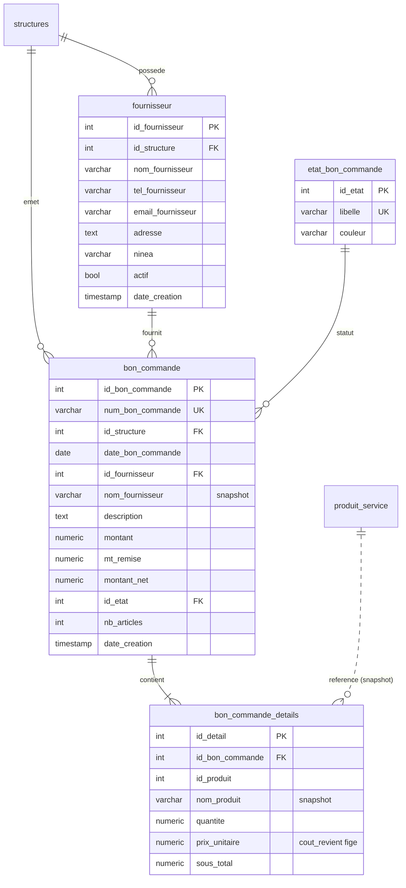
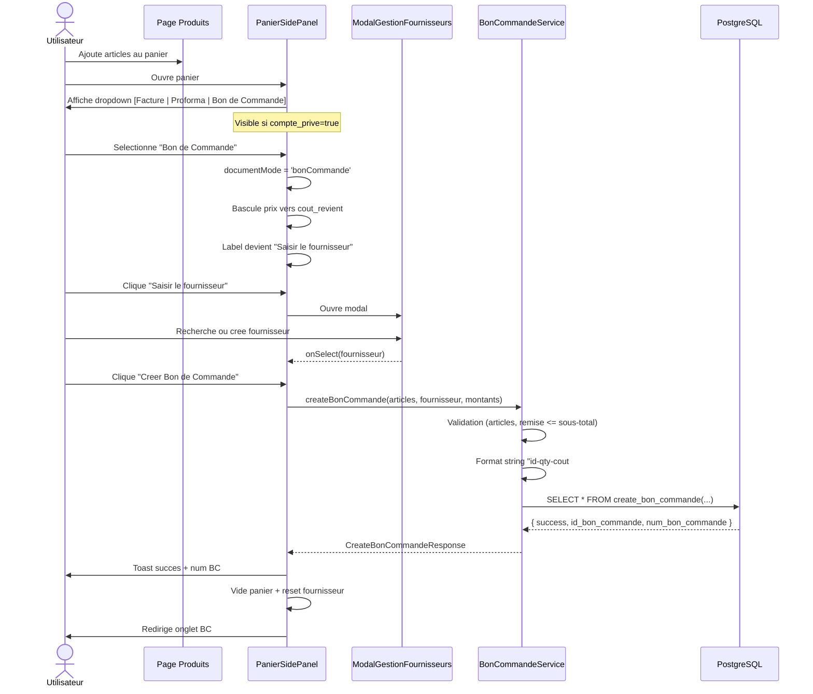
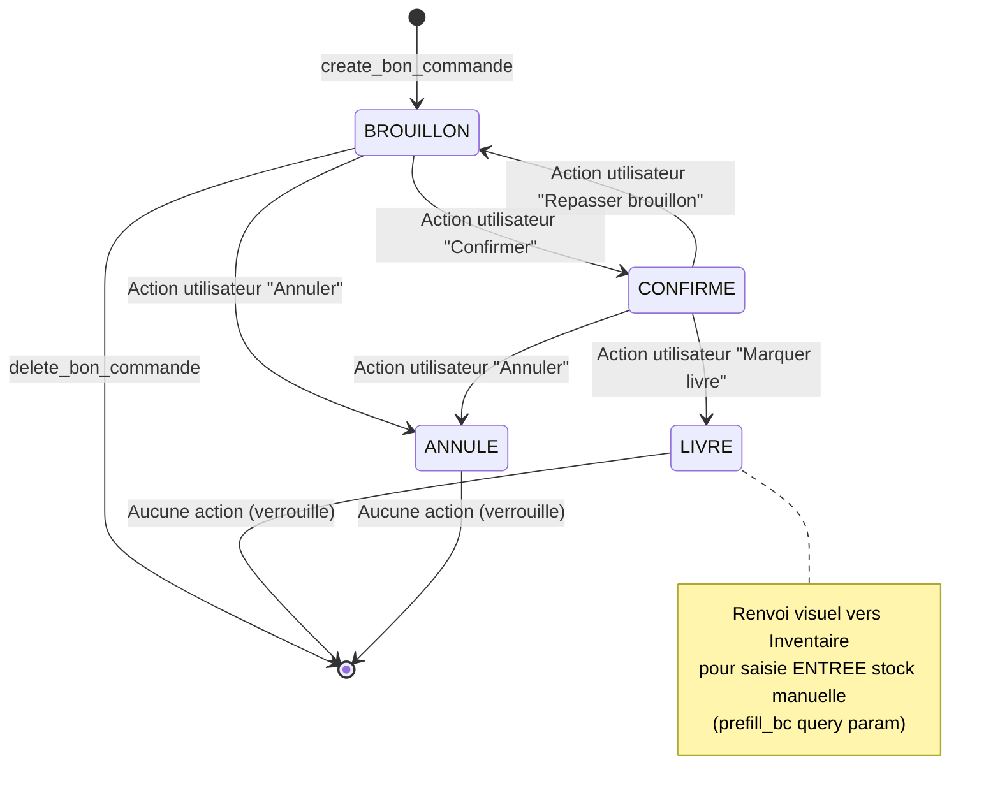

# PRD : Bons de Commande Fournisseurs (Comptes Privés)

> **Product Requirements Document** | Projet: FayClick V2

---

## Informations Générales

| Champ | Valeur |
|-------|--------|
| **Projet** | FayClick V2 |
| **Fonctionnalité** | Bons de Commande Fournisseurs (BC) |
| **Version PRD** | 1.0 |
| **Date création** | 2026-05-25 |
| **Auteur** | Équipe ICELABSOFT-SARL (Lead : Chef de Projet IT) |
| **Statut** | Draft — En validation PO |
| **Priorité** | Must Have |
| **Branche** | `feature/bons-commande-fournisseurs` |
| **Condition d'activation** | `compte_prive = true` uniquement |
| **PRD de référence** | `docs/prd-factures-proformes-2026-03-13.md` |
| **Plan stratégique** | `C:\Users\DELL 5581\.claude\plans\d-marrons-un-nouveau-prd-lexical-star.md` |

---

## 1. Objectif

### 1.1 Résumé Exécutif

Permettre aux structures FayClick V2 disposant d'un **compte privé** de gérer leurs **bons de commande fournisseurs (BC)** depuis l'interface FayClick. Les BC formalisent les commandes passées aux fournisseurs (flux entrant approvisionnement), distinctement des proformas (devis sortant vers clients) et des factures (vente effective).

Ce module introduit également la première **gestion CRUD complète des fournisseurs** dans FayClick (table jusqu'ici inexistante), réutilisable pour des évolutions futures (paiement fournisseur, comptabilité, statistiques d'approvisionnement).

Le module est **symétrique du module Proforma** côté approvisionnement, avec deux différences structurelles majeures :
- Prix unitaire = `cout_revient` du produit (et non `prix_vente`)
- **Aucun mouvement de stock automatique** (la réception se fait manuellement via le module Inventaire existant en V1)

### 1.2 Objectifs Mesurables

| # | Objectif | Mesure | Cible |
|---|---|---|---|
| O1 | Création d'un BC en moins de 90 secondes (workflow panier + saisie fournisseur) | Temps moyen utilisateur | < 90s |
| O2 | Adoption BC parmi comptes privés actifs | % comptes privés ayant créé ≥ 1 BC sur 30j | > 40% |
| O3 | Aucun mouvement de stock automatique sur création BC | Vérification audit (compteur ventes_details) | 0 mouvement |
| O4 | Aucune régression sur Factures et Proformas existants | Suite QA régression (24 tests) | 100% pass |
| O5 | Aucune régression sur PanierSidePanel modes Facture/Proforma | Tests dropdown 3 modes | 100% pass |
| O6 | Délai création fournisseur (CRUD) | Temps modal CRUD complet | < 30s |

---

## 2. Contexte

### 2.1 Problème

Les commerçants en `compte_prive` formalisent actuellement leurs commandes fournisseurs hors-application (WhatsApp, papier, Excel). Il en résulte :
- Pas de traçabilité historique des commandes
- Pas de document professionnel à transmettre au fournisseur
- Pas de répertoire central des fournisseurs
- Pas de visibilité sur le montant total des commandes en cours

### 2.2 Situation Actuelle

- **Module Proforma livré** sur branche `feature/factures-proformes` (cf. PRD existant) — fournit le squelette technique réutilisable
- **Aucune table `fournisseur` en BD** (vérifié par audit : 3 fichiers `fournisseur` dans le repo, tous des docs/privacy)
- **Aucun travail BC commencé** (Grep `bon_commande` : 1 seul commentaire dans `types/produit.ts:46`)
- **Champ `cout_revient` existe** sur `produit_service` et représente déjà le coût d'achat unitaire
- **Module Inventaire fonctionnel** : gère les mouvements ENTRÉE/SORTIE/AJUSTEMENT manuellement

### 2.3 Impact Attendu

| Type d'impact | Description | Mesure |
|---|---|---|
| Business | Professionnalisation de la relation fournisseur | Adoption > 40% comptes privés / 30j |
| Utilisateur | Workflow approvisionnement intégré (panier → BC) | Temps création < 90s |
| Technique | Module isolé + table fournisseur réutilisable | 0 régression Factures/Proformas |
| Données | Constitution d'un référentiel fournisseurs | Nombre fournisseurs créés / structure |

---

## 3. Utilisateurs Concernés

### 3.1 Personas

| Persona | Bénéfice Principal | Fréquence | Priorité |
|---|---|---|---|
| **Admin (compte_prive)** | Crée/édite BC, gère le répertoire fournisseurs, suit les commandes en cours | Hebdomadaire | Haute |
| **Manager (compte_prive)** | Crée des BC, change statut (CONFIRMÉ/LIVRÉ), imprime | Quotidienne | Haute |
| **Caissier (compte_prive)** | Crée des BC, consultation liste sans accès aux montants (canViewCA=false) | Occasionnelle | Moyenne |
| **Fournisseur (externe)** | Reçoit le PDF/papier du BC (hors-app) | Occasionnelle | N/A |

### 3.2 Parcours Utilisateur Principal — Création BC depuis Panier

```
1. Page Produits → ajouter articles au panier (PanierSidePanel ouvert)
   ↓
2. Dropdown "Type de document" en haut du panier :
   [Facture | Proforma | Bon de Commande]
   → Sélectionner "Bon de Commande"
   ↓
3. Le label "Saisir le client" devient "Saisir le fournisseur"
   Les prix affichés basculent de prix_vente → cout_revient
   ↓
4. Cliquer "Saisir le fournisseur" → ModalGestionFournisseurs
   - Rechercher fournisseur existant OU créer nouveau
   ↓
5. Cliquer "Créer Bon de Commande"
   ↓
6. Toast succès avec num_bon_commande (BC-{id_structure}-{seq})
   Panier vidé, redirection vers onglet Bons de Commande
```

### 3.3 Parcours Cycle de Vie d'un BC

```
[BROUILLON]
   │  (édition libre, suppression possible)
   │  ↓ Action "Confirmer"
[CONFIRMÉ]
   │  (édition limitée, document figé pour transmission fournisseur)
   │  ↓ Action "Marquer comme livré" (manuel)
[LIVRÉ]
   │  (verrouillé : pas d'édition, pas de suppression)
   │  → Renvoi visuel vers Inventaire pour saisie ENTRÉE stock
   │
   └─→ [ANNULÉ] (depuis BROUILLON ou CONFIRMÉ uniquement)
```

### 3.4 Parcours Gestion Fournisseurs

```
1. Modal "Saisir le fournisseur" depuis création BC
   OU
   Page settings / accès dédié (V2 — non couvert V1)
   ↓
2. Liste fournisseurs de la structure (recherche par nom)
   ↓
3. Actions disponibles :
   - Sélectionner (depuis création BC) → renvoie au panier
   - Créer un nouveau fournisseur (modal formulaire)
   - Éditer fournisseur existant
   - Désactiver fournisseur (soft delete via `actif=false`)
```

---

## 4. Exigences Fonctionnelles

### EPIC 1 — Module Fournisseurs (BD + Service + UI)

#### FR-001 : Table `fournisseur` et `etat_bon_commande`

| Champ | Valeur |
|---|---|
| **ID** | FR-001 |
| **Priorité** | Must Have |
| **Story estimée** | 1 j |

**Description :**
Créer la table PostgreSQL `fournisseur` (nouvelle dans FayClick) et la table de référence `etat_bon_commande` (4 valeurs).

**DDL `fournisseur` :**
```sql
CREATE TABLE fournisseur (
  id_fournisseur     SERIAL PRIMARY KEY,
  id_structure       INTEGER NOT NULL REFERENCES structures(id_structure),
  nom_fournisseur    VARCHAR(200) NOT NULL,
  tel_fournisseur    VARCHAR(20),
  email_fournisseur  VARCHAR(150),
  adresse            TEXT,
  ninea              VARCHAR(50),
  notes              TEXT,
  actif              BOOLEAN NOT NULL DEFAULT TRUE,
  date_creation      TIMESTAMP NOT NULL DEFAULT NOW(),
  date_modification  TIMESTAMP,
  CONSTRAINT uq_fournisseur_struct_nom UNIQUE (id_structure, nom_fournisseur)
);
CREATE INDEX idx_fournisseur_structure ON fournisseur(id_structure) WHERE actif = TRUE;
CREATE INDEX idx_fournisseur_nom_lower ON fournisseur(id_structure, LOWER(nom_fournisseur));
```

**DDL `etat_bon_commande` :**
```sql
CREATE TABLE etat_bon_commande (
  id_etat   INTEGER PRIMARY KEY,
  libelle   VARCHAR(30) NOT NULL UNIQUE,
  couleur   VARCHAR(20)
);
INSERT INTO etat_bon_commande VALUES
  (1, 'BROUILLON', 'slate'),
  (2, 'CONFIRME',  'blue'),
  (3, 'LIVRE',     'emerald'),
  (4, 'ANNULE',    'red');
```

**Critères d'Acceptance :**
- [ ] Table `fournisseur` créée avec FK, index, contrainte UNIQUE `(id_structure, nom_fournisseur)`
- [ ] Soft delete via colonne `actif BOOLEAN` (pas de DELETE physique en V1)
- [ ] Index partiel sur `actif=TRUE` pour performance liste
- [ ] Index `LOWER(nom_fournisseur)` pour recherche case-insensitive
- [ ] Table `etat_bon_commande` seedée avec 4 valeurs (1..4)

---

#### FR-002 : Fonction `create_fournisseur`

| Champ | Valeur |
|---|---|
| **ID** | FR-002 |
| **Priorité** | Must Have |
| **Story estimée** | 0,5 j |

**Description :** Fonction PostgreSQL pour créer un fournisseur, avec gestion du conflit de doublon.

**Signature :**
```sql
CREATE OR REPLACE FUNCTION create_fournisseur(
  p_id_structure       INTEGER,
  p_nom_fournisseur    VARCHAR,
  p_tel_fournisseur    VARCHAR DEFAULT NULL,
  p_email_fournisseur  VARCHAR DEFAULT NULL,
  p_adresse            TEXT    DEFAULT NULL,
  p_ninea              VARCHAR DEFAULT NULL,
  p_notes              TEXT    DEFAULT NULL
) RETURNS JSON
-- Retour: { success: bool, id_fournisseur: int|null, message: text }
```

**Logique :**
1. Vérifier que `nom_fournisseur` est non vide
2. Tentative INSERT, capture exception sur UNIQUE → retourner doublon
3. Retour JSON formaté

**Critères d'Acceptance :**
- [ ] Création réussie retourne `{ success: true, id_fournisseur, message }`
- [ ] Doublon retourne `{ success: false, message: 'Fournisseur déjà existant' }`
- [ ] Nom vide retourne erreur
- [ ] `date_creation` auto-renseignée

---

#### FR-003 : Fonction `edit_fournisseur`

| Champ | Valeur |
|---|---|
| **ID** | FR-003 |
| **Priorité** | Must Have |
| **Story estimée** | 0,5 j |

**Description :** Modification d'un fournisseur. Tous les champs sont optionnels (NULL = pas de mise à jour via COALESCE).

**Signature :**
```sql
CREATE OR REPLACE FUNCTION edit_fournisseur(
  p_id_fournisseur     INTEGER,
  p_id_structure       INTEGER,  -- sécurité
  p_nom_fournisseur    VARCHAR DEFAULT NULL,
  p_tel_fournisseur    VARCHAR DEFAULT NULL,
  p_email_fournisseur  VARCHAR DEFAULT NULL,
  p_adresse            TEXT    DEFAULT NULL,
  p_ninea              VARCHAR DEFAULT NULL,
  p_notes              TEXT    DEFAULT NULL
) RETURNS JSON
-- { success: bool, message: text }
```

**Critères d'Acceptance :**
- [ ] Vérification appartenance `id_structure` obligatoire
- [ ] Pattern `COALESCE(p_xxx, xxx)` pour chaque champ
- [ ] `date_modification = NOW()` systématique
- [ ] Refus si renommage cause doublon (UNIQUE catchée)

---

#### FR-004 : Fonction `delete_fournisseur` (soft delete)

| Champ | Valeur |
|---|---|
| **ID** | FR-004 |
| **Priorité** | Must Have |
| **Story estimée** | 0,3 j |

**Description :** Désactivation d'un fournisseur (`actif = FALSE`). Pas de DELETE physique pour préserver l'historique des BC.

**Signature :**
```sql
CREATE OR REPLACE FUNCTION delete_fournisseur(
  p_id_fournisseur INTEGER,
  p_id_structure   INTEGER
) RETURNS JSON
```

**Critères d'Acceptance :**
- [ ] Soft delete via `UPDATE ... SET actif = FALSE`
- [ ] Vérification appartenance `id_structure`
- [ ] Le fournisseur reste lié aux BC historiques
- [ ] Fournisseur désactivé n'apparaît plus dans `get_list_fournisseurs`

---

#### FR-005 : Fonction `get_list_fournisseurs`

| Champ | Valeur |
|---|---|
| **ID** | FR-005 |
| **Priorité** | Must Have |
| **Story estimée** | 0,3 j |

**Description :** Liste paginée des fournisseurs actifs d'une structure, avec compteur BC.

**Signature :**
```sql
CREATE OR REPLACE FUNCTION get_list_fournisseurs(
  p_id_structure INTEGER
) RETURNS JSON
-- Retour: [{ id_fournisseur, nom_fournisseur, tel_fournisseur, email_fournisseur,
--            adresse, ninea, nb_bons_commandes, date_creation }, ...]
```

**Critères d'Acceptance :**
- [ ] Liste triée par `nom_fournisseur ASC`
- [ ] Filtre `actif = TRUE`
- [ ] `nb_bons_commandes` calculé par jointure agrégée
- [ ] Format JSON array (parsable côté front)

---

#### FR-006 : Service Frontend `fournisseur.service.ts` + Types

| Champ | Valeur |
|---|---|
| **ID** | FR-006 |
| **Priorité** | Must Have |
| **Story estimée** | 1 j |

**Description :** Créer `services/fournisseur.service.ts` (singleton, cache 5 min) et `types/fournisseur.ts`.

**Méthodes :**
```typescript
class FournisseurService {
  createFournisseur(data: CreateFournisseurInput): Promise<CreateFournisseurResponse>
  editFournisseur(id: number, data: Partial<Fournisseur>): Promise<{success, message}>
  deleteFournisseur(id: number): Promise<{success, message}>
  getListFournisseurs(): Promise<FournisseurListResponse>
  searchFournisseurByName(query: string): Fournisseur[]  // recherche locale sur cache
  invalidateCache(): void
}
```

**Types principaux :**
```typescript
interface Fournisseur {
  id_fournisseur: number;
  id_structure: number;
  nom_fournisseur: string;
  tel_fournisseur: string | null;
  email_fournisseur: string | null;
  adresse: string | null;
  ninea: string | null;
  notes: string | null;
  nb_bons_commandes: number;
  date_creation: string;
}
interface CreateFournisseurResponse { success: boolean; id_fournisseur?: number; message: string }
interface FournisseurListResponse { fournisseurs: Fournisseur[]; total: number }
```

**Critères d'Acceptance :**
- [ ] Singleton via export default instance
- [ ] Import `DatabaseService` direct (pas `.getInstance()`)
- [ ] Vérification `typeof === 'string'` avant `JSON.parse()`
- [ ] Cache 5 min invalidé après create/edit/delete
- [ ] Recherche locale insensible à la casse + accents
- [ ] Gestion d'erreur `FournisseurApiException`

---

#### FR-007 : Composant `ModalGestionFournisseurs` (CRUD UI)

| Champ | Valeur |
|---|---|
| **ID** | FR-007 |
| **Priorité** | Must Have |
| **Story estimée** | 2 j |

**Description :** Modal combinant **liste + recherche + création + édition + désactivation** de fournisseurs. Réutilisable comme :
- Sélecteur dans création BC (renvoie un fournisseur sélectionné via callback `onSelect`)
- Panneau de gestion seule (mode `gestionSeule = true`, pas de sélection)

**Composants :**
- `components/fournisseurs/ModalGestionFournisseurs.tsx`
- `components/fournisseurs/ModalCreerFournisseur.tsx` (formulaire)
- `components/fournisseurs/FournisseurCard.tsx` (carte liste)
- `components/fournisseurs/index.ts`

**Critères d'Acceptance :**
- [ ] Design glassmorphism cohérent avec ModalRechercheClient
- [ ] Recherche en temps réel (debounce 200ms)
- [ ] Formulaire création : nom obligatoire, tel/email/adresse/ninea/notes optionnels
- [ ] Validation : email format si fourni, tel 9 chiffres si fourni (avertissement)
- [ ] Mode `onSelect` : clic sur carte renvoie fournisseur au parent et ferme la modal
- [ ] Toast succès sur create/edit/delete
- [ ] Responsive mobile + desktop

---

### EPIC 2 — Base de Données & API Bons de Commande

#### FR-008 : Tables `bon_commande` + `bon_commande_details`

| Champ | Valeur |
|---|---|
| **ID** | FR-008 |
| **Priorité** | Must Have |
| **Story estimée** | 1 j |

**Description :** Créer les tables `bon_commande` (entête) et `bon_commande_details` (lignes), avec FK cascade DELETE sur les détails.

**DDL `bon_commande` :**
```sql
CREATE TABLE bon_commande (
  id_bon_commande    SERIAL PRIMARY KEY,
  num_bon_commande   VARCHAR(50) NOT NULL UNIQUE,
  id_structure       INTEGER NOT NULL REFERENCES structures(id_structure),
  date_bon_commande  DATE NOT NULL DEFAULT CURRENT_DATE,
  id_fournisseur     INTEGER NOT NULL REFERENCES fournisseur(id_fournisseur),
  nom_fournisseur    VARCHAR(200),       -- dénormalisé (snapshot)
  tel_fournisseur    VARCHAR(20),
  description        TEXT,
  montant            NUMERIC(12,2) NOT NULL DEFAULT 0,   -- sous-total brut
  mt_remise          NUMERIC(12,2) NOT NULL DEFAULT 0,
  montant_net        NUMERIC(12,2) NOT NULL DEFAULT 0,   -- montant - mt_remise
  id_etat            INTEGER NOT NULL DEFAULT 1 REFERENCES etat_bon_commande(id_etat),
  nb_articles        INTEGER NOT NULL DEFAULT 0,
  id_utilisateur     INTEGER,
  date_creation      TIMESTAMP NOT NULL DEFAULT NOW(),
  date_modification  TIMESTAMP,
  CONSTRAINT chk_bc_montant_net CHECK (montant_net >= 0),
  CONSTRAINT chk_bc_remise_positive CHECK (mt_remise >= 0)
);
CREATE INDEX idx_bc_structure_etat ON bon_commande(id_structure, id_etat);
CREATE INDEX idx_bc_structure_date ON bon_commande(id_structure, date_creation DESC);
CREATE INDEX idx_bc_fournisseur ON bon_commande(id_fournisseur);
```

**DDL `bon_commande_details` :**
```sql
CREATE TABLE bon_commande_details (
  id_detail        SERIAL PRIMARY KEY,
  id_bon_commande  INTEGER NOT NULL REFERENCES bon_commande(id_bon_commande) ON DELETE CASCADE,
  id_produit       INTEGER NOT NULL,    -- pas de FK stricte (snapshot historique)
  nom_produit      VARCHAR(200),        -- dénormalisé
  quantite         NUMERIC(10,2) NOT NULL CHECK (quantite > 0),
  prix_unitaire    NUMERIC(12,2) NOT NULL CHECK (prix_unitaire >= 0),  -- = cout_revient figé
  sous_total       NUMERIC(12,2) NOT NULL
);
CREATE INDEX idx_bcd_bc ON bon_commande_details(id_bon_commande);
```

**Séquence numéro BC :** Format `BC-{id_structure}-{seq}` où `seq` = compteur incrémental par structure (généré dans `create_bon_commande` via `SELECT COUNT(*)+1 FROM bon_commande WHERE id_structure = ?`).

**Critères d'Acceptance :**
- [ ] Tables créées avec FK, index, contraintes CHECK
- [ ] CASCADE DELETE sur `bon_commande_details`
- [ ] Snapshot `nom_produit` et `nom_fournisseur` (résilience produit/fournisseur supprimé)
- [ ] Index sur `(id_structure, id_etat)` et `(id_structure, date_creation DESC)`
- [ ] Numérotation `BC-{id_structure}-{seq}` unique

---

#### FR-009 : Fonction `create_bon_commande`

| Champ | Valeur |
|---|---|
| **ID** | FR-009 |
| **Priorité** | Must Have |
| **Story estimée** | 1 j |

**Description :** Crée un BC avec ses détails à partir d'un string articles formatté (convention proforma). **AUCUN mouvement de stock**.

**Signature :**
```sql
CREATE OR REPLACE FUNCTION create_bon_commande(
  p_id_structure      INTEGER,
  p_date_bon_commande DATE,
  p_id_fournisseur    INTEGER,
  p_description       TEXT,
  p_montant_net       NUMERIC,
  p_articles_string   TEXT,             -- "id_produit-qty-cout_revient#id_produit-qty-cout_revient#..."
  p_mt_remise         NUMERIC DEFAULT 0,
  p_id_utilisateur    INTEGER DEFAULT 0
) RETURNS JSON
-- Retour: { success, id_bon_commande, num_bon_commande, message }
```

**Logique interne :**
1. Vérifier fournisseur appartient à structure
2. Lire `nom_fournisseur` + `tel_fournisseur` depuis table (snapshot)
3. Calculer `seq` et générer `num_bon_commande`
4. INSERT entête `bon_commande` (id_etat=1 BROUILLON)
5. Parser `p_articles_string` (split `#` puis split `-`)
6. Pour chaque article : lire `nom_produit`, INSERT `bon_commande_details`
7. UPDATE `nb_articles` sur entête
8. Retour JSON

**Critères d'Acceptance :**
- [ ] BC créé avec statut BROUILLON
- [ ] `num_bon_commande` format `BC-{id_structure}-{seq}`
- [ ] **AUCUN appel aux fonctions de mouvement stock**
- [ ] Snapshot `nom_produit` capturé à la création
- [ ] Validation : articles non vides, `montant_net >= 0`, `mt_remise <= montant brut`
- [ ] Retour `{ success, id_bon_commande, num_bon_commande, message }`

---

#### FR-010 : Fonction `edit_bon_commande`

| Champ | Valeur |
|---|---|
| **ID** | FR-010 |
| **Priorité** | Must Have |
| **Story estimée** | 1 j |

**Description :** Modification d'un BC (entête + articles + statut). Refus si statut = LIVRE.

**Signature :**
```sql
CREATE OR REPLACE FUNCTION edit_bon_commande(
  p_id_bon_commande   INTEGER,
  p_id_structure      INTEGER,
  p_date_bon_commande DATE    DEFAULT NULL,
  p_id_fournisseur    INTEGER DEFAULT NULL,
  p_description       TEXT    DEFAULT NULL,
  p_montant_net       NUMERIC DEFAULT NULL,
  p_articles_string   TEXT    DEFAULT NULL,
  p_mt_remise         NUMERIC DEFAULT NULL,
  p_id_etat           INTEGER DEFAULT NULL
) RETURNS JSON
```

**Critères d'Acceptance :**
- [ ] Refus si `id_etat = 3 (LIVRE)` → `{ success: false, message: 'BC livré non modifiable' }`
- [ ] Si `p_articles_string` fourni : DELETE anciens détails + INSERT nouveaux
- [ ] Recalcul `nb_articles`
- [ ] Mise à jour `date_modification = NOW()`
- [ ] Transitions de statut autorisées (table de matrice ci-dessous)
- [ ] Vérification appartenance `id_structure`

**Matrice transitions `id_etat` :**

| Depuis ↓ \ Vers → | BROUILLON | CONFIRME | LIVRE | ANNULE |
|---|---|---|---|---|
| BROUILLON | — | ✅ | ❌ | ✅ |
| CONFIRME | ✅ | — | ✅ | ✅ |
| LIVRE | ❌ | ❌ | — | ❌ |
| ANNULE | ❌ | ❌ | ❌ | — |

---

#### FR-011 : Fonction `delete_bon_commande`

| Champ | Valeur |
|---|---|
| **ID** | FR-011 |
| **Priorité** | Must Have |
| **Story estimée** | 0,3 j |

**Description :** Suppression physique d'un BC + cascade détails. Refus si statut = LIVRE.

**Signature :**
```sql
CREATE OR REPLACE FUNCTION delete_bon_commande(
  p_id_bon_commande INTEGER,
  p_id_structure    INTEGER
) RETURNS JSON
```

**Critères d'Acceptance :**
- [ ] Refus si `id_etat = 3 (LIVRE)`
- [ ] Suppression cascade `bon_commande_details`
- [ ] Vérification appartenance `id_structure`
- [ ] Retour `{ success, message }`

---

#### FR-012 : Fonction `get_list_bons_commandes`

| Champ | Valeur |
|---|---|
| **ID** | FR-012 |
| **Priorité** | Must Have |
| **Story estimée** | 0,5 j |

**Description :** Liste des BC d'une structure + résumé global pour les cartes stats.

**Signature :**
```sql
CREATE OR REPLACE FUNCTION get_list_bons_commandes(
  p_id_structure INTEGER
) RETURNS JSON
-- Retour: {
--   bons_commandes: [{id_bon_commande, num_bon_commande, date_bon_commande,
--     id_fournisseur, nom_fournisseur, tel_fournisseur, montant, mt_remise,
--     montant_net, id_etat, libelle_etat, nb_articles, date_creation,
--     date_modification}, ...],
--   resume: {
--     total_bc: int, montant_total: numeric,
--     nb_brouillon: int, nb_confirme: int, nb_livre: int, nb_annule: int,
--     montant_en_attente: numeric  -- BROUILLON + CONFIRME
--   }
-- }
```

**Critères d'Acceptance :**
- [ ] Tri par `date_creation DESC`
- [ ] Inclut `libelle_etat` (BROUILLON/CONFIRME/LIVRE/ANNULE)
- [ ] Inclut `nb_articles` par BC
- [ ] Résumé agrégé pour les 4 cartes stats
- [ ] Filtre par `id_structure` strict

---

#### FR-013 : Fonction `get_bon_commande_details`

| Champ | Valeur |
|---|---|
| **ID** | FR-013 |
| **Priorité** | Must Have |
| **Story estimée** | 0,3 j |

**Description :** Détails complets d'un BC pour modal d'affichage / édition / impression.

**Signature :**
```sql
CREATE OR REPLACE FUNCTION get_bon_commande_details(
  p_id_bon_commande INTEGER,
  p_id_structure    INTEGER
) RETURNS JSON
-- Retour: {
--   bon_commande: { ...entête + fournisseur enrichi },
--   details: [{id_detail, id_produit, nom_produit, quantite, prix_unitaire, sous_total}, ...],
--   resume: { nb_articles, total_quantite, total_montant }
-- }
```

**Critères d'Acceptance :**
- [ ] Vérification `id_structure`
- [ ] Retour JSON conforme à `BonCommandeComplete` (cf. FR-014)
- [ ] Inclut détails fournisseur enrichis (email, adresse, ninea)

---

> **Note de divergence avec le brief PO** : le brief mentionne "8 fonctions PG", mais la décomposition détaillée (FR-002 à FR-005 = 4 fournisseur, FR-009 à FR-013 = 5 BC) en livre **9**. Le **séparation lecture liste / lecture détails** est la pratique standard FayClick (cf. `get_list_proformas` + `get_proforma_details`) et est nécessaire pour performance + isolation. Recommandation : retenir 9 fonctions au final.

---

### EPIC 3 — Service Frontend & Types BC

#### FR-014 : Types TypeScript `types/bon-commande.ts`

| Champ | Valeur |
|---|---|
| **ID** | FR-014 |
| **Priorité** | Must Have |
| **Story estimée** | 0,5 j |

**Description :** Définir toutes les interfaces nécessaires au module BC, alignées sur les retours PostgreSQL.

**Interfaces principales :**
```typescript
export type BonCommandeStatut = 'BROUILLON' | 'CONFIRME' | 'LIVRE' | 'ANNULE';

export interface BonCommande {
  id_bon_commande: number;
  num_bon_commande: string;          // BC-{id_structure}-{seq}
  id_structure: number;
  date_bon_commande: string;
  id_fournisseur: number;
  nom_fournisseur: string;
  tel_fournisseur: string | null;
  description: string | null;
  montant: number;
  mt_remise: number;
  montant_net: number;
  id_etat: number;
  libelle_etat: BonCommandeStatut;
  nb_articles: number;
  id_utilisateur: number | null;
  date_creation: string;
  date_modification: string | null;
}

export interface BonCommandeDetail {
  id_detail: number;
  id_bon_commande: number;
  id_produit: number;
  nom_produit: string;
  quantite: number;
  prix_unitaire: number;   // = cout_revient figé
  sous_total: number;
}

export interface BonCommandeResumeStats {
  total_bc: number;
  montant_total: number;
  nb_brouillon: number;
  nb_confirme: number;
  nb_livre: number;
  nb_annule: number;
  montant_en_attente: number;
}

export interface BonCommandeComplete {
  bon_commande: BonCommande;
  details: BonCommandeDetail[];
  resume: { nb_articles: number; total_quantite: number; total_montant: number };
}

export interface BonCommandeListResponse {
  bons_commandes: BonCommande[];
  resume: BonCommandeResumeStats;
}

export interface CreateBonCommandeResponse {
  success: boolean;
  id_bon_commande?: number;
  num_bon_commande?: string;
  message: string;
}

export interface BonCommandeActionResponse {
  success: boolean;
  message: string;
}

export interface FiltresBonsCommandes {
  statut?: BonCommandeStatut | 'TOUS';
  fournisseur?: string;       // recherche nom
  dateDebut?: string;
  dateFin?: string;
  search?: string;            // recherche libre (num, fournisseur, description)
}
```

**Critères d'Acceptance :**
- [ ] Tous types exportés via `index.ts` central
- [ ] Cohérence stricte avec retour PostgreSQL des fonctions FR-012/FR-013
- [ ] Pas de `any`, typage strict

---

#### FR-015 : Service `bon-commande.service.ts`

| Champ | Valeur |
|---|---|
| **ID** | FR-015 |
| **Priorité** | Must Have |
| **Story estimée** | 1 j |

**Description :** Service singleton de gestion CRUD des BC, calqué sur `proforma.service.ts`.

**Méthodes :**
```typescript
class BonCommandeService {
  createBonCommande(
    articles: ArticlePanier[],
    fournisseur: { id_fournisseur: number; nom: string; tel?: string },
    montants: { sous_total: number; mt_remise: number; montant_net: number },
    description?: string
  ): Promise<CreateBonCommandeResponse>;

  getListBonsCommandes(forceRefresh?: boolean): Promise<BonCommandeListResponse>;
  getBonCommandeDetails(idBC: number): Promise<BonCommandeComplete>;

  editBonCommande(idBC: number, data: Partial<BonCommandeEditInput>): Promise<BonCommandeActionResponse>;
  deleteBonCommande(idBC: number): Promise<BonCommandeActionResponse>;

  updateStatut(idBC: number, statut: BonCommandeStatut): Promise<BonCommandeActionResponse>;

  invalidateCache(): void;
}
```

**Critères d'Acceptance :**
- [ ] Singleton pattern (export default instance)
- [ ] Import `DatabaseService` direct, pas `.getInstance()`
- [ ] Vérification `typeof === 'string'` avant `JSON.parse()` sur retours PG
- [ ] Format articles : `articles.map(a => `${a.id_produit}-${a.quantite}-${a.cout_revient}`).join('#')`
- [ ] Validation côté service : articles non vides, fournisseur obligatoire, `mt_remise <= sous_total`
- [ ] Cache 5 min sur `getListBonsCommandes`, invalidation après mutations
- [ ] Gestion erreur via classe `BonCommandeApiException`

---

#### FR-016 : Store Zustand `panierBonCommandeStore.ts`

| Champ | Valeur |
|---|---|
| **ID** | FR-016 |
| **Priorité** | Should Have |
| **Story estimée** | 0,5 j |

**Description :** Store Zustand dédié si workflow de création BC indépendant du panier principal (option). En **V1**, le store est utilisé uniquement si l'utilisateur quitte la page Produits et revient — pour persistance.

**État :**
```typescript
interface PanierBCState {
  articles: ArticlePanierBC[];          // { id_produit, nom_produit, quantite, prix_applique (= cout_revient) }
  fournisseur: { id_fournisseur, nom, tel } | null;
  remise: number;
  setArticles(articles): void;
  setFournisseur(f): void;
  setRemise(r): void;
  clear(): void;
  getSousTotal(): number;
  getMontantNet(): number;
}
```

**Critères d'Acceptance :**
- [ ] Persist via `zustand/middleware` (localStorage key `'fayclick-panier-bon-commande'`)
- [ ] `clear()` réinitialise articles + fournisseur + remise
- [ ] Indépendant des stores `panierStore` et `panierProformaStore`

> **Note** : En V1, le mode BC dans `PanierSidePanel` peut réutiliser `panierStore` (panier principal) avec un mode flag — sans nouveau store. Décision finale au moment de l'implémentation.

---

### EPIC 4 — Interface Utilisateur BC (Onglet + Composants + Dropdown Panier)

#### FR-017 : Refonte `PanierSidePanel` — Dropdown 3 modes

| Champ | Valeur |
|---|---|
| **ID** | FR-017 |
| **Priorité** | Must Have |
| **Story estimée** | 1,5 j |

**Description :** Remplacer la checkbox "Proforma" actuelle dans `PanierSidePanel` par un **dropdown / segmented control 3 choix** : Facture / Proforma / Bon de Commande.

**Spécifications UI :**
- Composant : `SegmentedControl` ou `<select>` stylisé glassmorphism
- Visible uniquement si `compte_prive === true` (sinon mode forcé `'facture'`, aucun dropdown)
- État local : `documentMode: 'facture' | 'proforma' | 'bonCommande'`
- Icônes (lucide-react) : `FileText` (facture), `FileCheck` (proforma), `Package` (BC)
- Tooltip explicatif au survol de chaque option

**Adaptation conditionnelle selon `documentMode === 'bonCommande'` :**
| Élément | Mode Facture/Proforma | Mode BC |
|---|---|---|
| Label bouton sélection | "Saisir le client" | "Saisir le fournisseur" |
| Modal sélection | `ModalRechercheClient` | `ModalGestionFournisseurs` (mode `onSelect`) |
| Prix affichés | `prix_vente` | `cout_revient` (fallback `prix_vente` si =0 + warning) |
| Soumission | `factureService` / `proformaService` | `bonCommandeService` |
| Texte bouton submit | "Créer Facture" / "Créer Proforma" | "Créer Bon de Commande" |
| Acompte | Visible (facture) / Caché (proforma) | Caché |

**Critères d'Acceptance :**
- [ ] Dropdown 3 modes affiché en haut du panier si `compte_prive=true`
- [ ] Switch mode reset l'entité sélectionnée (client/fournisseur) + warning visuel
- [ ] Mode BC bascule tous les prix vers `cout_revient`
- [ ] Fallback `prix_vente` si `cout_revient = 0`, avec icône warning + tooltip "Coût de revient non renseigné — utilisation prix de vente"
- [ ] Modes Facture et Proforma **inchangés fonctionnellement** (0 régression)
- [ ] Persistance du mode sélectionné en session (sessionStorage)
- [ ] Test régression : workflow Facture classique + workflow Proforma intacts

---

#### FR-018 : Onglet "Bons de Commande" dans page Factures

| Champ | Valeur |
|---|---|
| **ID** | FR-018 |
| **Priorité** | Must Have |
| **Story estimée** | 0,5 j |

**Description :** Ajouter un 4e onglet "Bons de Commande" dans `FacturesOnglets`, visible uniquement si `compte_prive=true`.

**Spécifications :**
- Étendre `TabId = 'factures' | 'paiements' | 'proformas' | 'bonsCommandes'`
- Icône : `Package` (lucide-react), couleur `cyan` / `blue-500`
- Badge compteur : nombre total de BC
- Animation `layoutId` cohérente
- Prop `showBonsCommandes` passée depuis page Factures

**Critères d'Acceptance :**
- [ ] 4e onglet affiché si `compte_prive=true`
- [ ] Caché si `compte_prive=false`
- [ ] Badge compteur fonctionnel
- [ ] Design glassmorphism cohérent avec les 3 autres onglets
- [ ] Responsive mobile/desktop

---

#### FR-019 : Composant orchestrateur `BonCommandesTab`

| Champ | Valeur |
|---|---|
| **ID** | FR-019 |
| **Priorité** | Must Have |
| **Story estimée** | 1 j |

**Description :** Composant orchestrateur du contenu de l'onglet : stats, filtres, pagination, modals, gestion d'état.

**Sous-composants gérés :**
- `StatsCardsBonsCommandes` (haut)
- `BonCommandesList` (liste mobile cartes)
- `BonCommandesDesktopView` (tableau desktop, V1.1 optionnel)
- Modals : `ModalCreerBonCommande`, `ModalBonCommandeDetails`, `ModalImpressionBonCommande`, `ModalGestionFournisseurs`

**Filtres :**
- Statut (TOUS / BROUILLON / CONFIRME / LIVRE / ANNULE)
- Recherche libre (num BC, fournisseur, description)
- Période (date début / date fin)
- Fournisseur (autocomplete depuis cache)

**Pagination :** 20 BC par page, infinite scroll mobile + pagination explicite desktop.

**Critères d'Acceptance :**
- [ ] Chargement initial via `bonCommandeService.getListBonsCommandes()`
- [ ] Filtres appliqués côté client (sur cache)
- [ ] Refresh sur retour d'une modal de création/édition
- [ ] Loading state + empty state + error state gérés
- [ ] Bouton "+ Nouveau Bon de Commande" en haut

---

#### FR-020 : Composants `BonCommandeCard` + `BonCommandeStatusBadge`

| Champ | Valeur |
|---|---|
| **ID** | FR-020 |
| **Priorité** | Must Have |
| **Story estimée** | 1 j |

**Description :** Cartes individuelles de BC + badge statut coloré.

**`BonCommandeStatusBadge` :**
| Statut | Couleur | Icône |
|---|---|---|
| BROUILLON | slate-500 | FileEdit |
| CONFIRME | blue-500 | CheckCircle |
| LIVRE | emerald-500 | PackageCheck |
| ANNULE | red-500 | XCircle |

**`BonCommandeCard` (mobile) :**
- Affiche : `num_bon_commande`, fournisseur, montant, badge statut, date, `nb_articles`
- Actions contextuelles selon statut (cf. matrice transitions FR-010) :
  - BROUILLON : Voir / Modifier / Confirmer / Supprimer / Annuler / Imprimer
  - CONFIRME : Voir / Modifier / Marquer livré / Annuler / Imprimer
  - LIVRE : Voir / Imprimer + lien "Saisir entrée stock dans Inventaire"
  - ANNULE : Voir / Imprimer (lecture seule)

**Critères d'Acceptance :**
- [ ] Carte glassmorphism cohérente avec `FactureCard` et `ProformaCard`
- [ ] Badge statut affiché correctement
- [ ] Actions contextuelles selon statut
- [ ] Montants masqués (`***`) si `canViewCA === false`
- [ ] Clic carte ouvre `ModalBonCommandeDetails`
- [ ] Lien "Saisir entrée stock" pour BC LIVRE (lien `/dashboard/commerce/inventaire?prefill=BC-XXX`)

---

#### FR-021 : Modal `ModalCreerBonCommande`

| Champ | Valeur |
|---|---|
| **ID** | FR-021 |
| **Priorité** | Must Have |
| **Story estimée** | 1,5 j |

**Description :** Modal de **création directe d'un BC depuis l'onglet** (sans passer par le panier). Workflow alternatif au dropdown panier pour utilisateurs préférant l'approche dédiée.

**Sections du modal :**
1. **Sélection fournisseur** (obligatoire) — bouton ouvrant `ModalGestionFournisseurs`
2. **Sélection produits** — recherche + scan code-barres + saisie quantité + prix éditable (`cout_revient` par défaut)
3. **Description / Notes** (optionnel)
4. **Résumé** — sous-total, remise éditable, montant net
5. **Bouton "Créer Bon de Commande"**

**Critères d'Acceptance :**
- [ ] Fournisseur obligatoire
- [ ] Sélection produits avec **scan code-barres pattern `filter()` + modal sélection si matches > 1**
- [ ] Prix unitaire éditable (pré-rempli avec `cout_revient`)
- [ ] Si `cout_revient = 0` : warning visuel + champ obligatoire
- [ ] Remise globale supportée (validation `remise <= sous_total`)
- [ ] PAS d'acompte
- [ ] PAS de mouvement stock à la création
- [ ] Toast succès avec `num_bon_commande`
- [ ] Mode édition : pré-remplissage si `bonCommande` passé en prop

---

#### FR-022 : Modal `ModalBonCommandeDetails` + Actions de changement de statut

| Champ | Valeur |
|---|---|
| **ID** | FR-022 |
| **Priorité** | Must Have |
| **Story estimée** | 1 j |

**Description :** Modal affichant tous les détails d'un BC + actions selon statut (changer statut, modifier, imprimer, supprimer).

**Sections affichées :**
- Header : `num_bon_commande`, badge statut, date
- Bloc fournisseur : nom, tél, adresse, ninea
- Liste articles (tableau) : produit, qté, prix unitaire, sous-total
- Totaux : sous-total, remise, montant net
- Description / notes
- Historique : date création, date modification, utilisateur créateur
- Actions : boutons contextuels (cf. FR-020)

**Modal de confirmation pour changements de statut :**
- BROUILLON → CONFIRME : "Confirmer ce bon de commande ? Il sera figé pour transmission au fournisseur."
- CONFIRME → LIVRE : "Marquer comme livré ? Pensez à saisir l'entrée stock dans le module Inventaire."
- *→ ANNULE : "Annuler ce bon de commande ? Cette action est définitive."

**Critères d'Acceptance :**
- [ ] Affichage complet conforme à `BonCommandeComplete`
- [ ] Boutons actions selon statut (matrice transitions)
- [ ] Confirmation modale avant changement de statut destructif
- [ ] Montants masqués si `canViewCA=false`
- [ ] Lien "Saisir entrée stock" pour BC LIVRE
- [ ] Refresh liste BC après action

---

#### FR-023 : Stats `StatsCardsBonsCommandes`

| Champ | Valeur |
|---|---|
| **ID** | FR-023 |
| **Priorité** | Should Have |
| **Story estimée** | 0,5 j |

**Description :** 4 cartes glassmorphism en haut de l'onglet BC.

**Cartes :**
1. **Total BC** : `total_bc` (nombre)
2. **Montant total commandes** : `montant_total` (FCFA, masqué si `canViewCA=false`)
3. **En attente** : `nb_brouillon + nb_confirme` + sous-libellé "X BROUILLON / Y CONFIRMÉ"
4. **Livrés** : `nb_livre` + sous-libellé "Z commandes reçues"

**Critères d'Acceptance :**
- [ ] 4 cartes glassmorphism cohérentes avec stats Factures/Proformas
- [ ] Animations framer-motion (fade in)
- [ ] Masquage montants si `canViewCA=false` → `***`
- [ ] Responsive : 2x2 mobile, 4x1 desktop

---

### EPIC 5 — Impression & Stats

#### FR-024 : Modal `ModalImpressionBonCommande`

| Champ | Valeur |
|---|---|
| **ID** | FR-024 |
| **Priorité** | Must Have |
| **Story estimée** | 1 j |

**Description :** Modal d'impression BC, calqué sur `ModalImpressionDocuments` existant. Format A4 personnalisé ou standard + ticket 80mm optionnel.

**Spécifications :**
- Format A4 : layout `Personnalisé` (utilise `config_facture`) ou `Standard` (centré)
- Titre du document : **"BON DE COMMANDE"** (gros, en haut)
- En-tête : numéro `BC-XXX`, date, badge statut
- Bloc fournisseur : nom, adresse, tél, email, ninea
- Bloc structure (émetteur) : depuis `info_facture` (adresse, tél, NINEA, RC)
- Tableau articles : produit, qté, prix unitaire, sous-total
- Totaux : sous-total, remise, **montant net**
- Mention bas de page : "Document à transmettre au fournisseur — Non valable comme facture"
- Signature : champ vide pour signature manuelle

**Ticket 80mm (optionnel) :** Génération via `lib/generate-ticket-html.ts` avec badge `BON DE COMMANDE`.

**Critères d'Acceptance :**
- [ ] Layout `Personnalisé` utilise `config_facture` (cohérence avec factures)
- [ ] Layout `Standard` : design centré classique FayClick
- [ ] Titre "BON DE COMMANDE" visible en gros
- [ ] Numéro `BC-{id_structure}-{seq}` affiché
- [ ] Badge statut visible (BROUILLON / CONFIRME / LIVRE / ANNULE)
- [ ] Mention "Non valable comme facture" en bas
- [ ] Impression via iframe cachée + `window.print()`
- [ ] Ticket 80mm fonctionnel avec badge

---

#### FR-025 : Intégration Inventaire — Lien BC LIVRE → Saisie ENTRÉE Stock

| Champ | Valeur |
|---|---|
| **ID** | FR-025 |
| **Priorité** | Should Have |
| **Story estimée** | 1 j |

**Description :** Faciliter la saisie manuelle d'entrée stock après livraison BC : lien direct depuis BC LIVRE vers le module Inventaire avec pré-remplissage des articles.

**Workflow :**
1. BC passe en statut LIVRE
2. Modal de confirmation affiche : "Marquer comme livré ? Pensez à saisir l'entrée stock."
3. Bouton "Aller au module Inventaire avec les articles pré-remplis"
4. Navigation `/dashboard/commerce/inventaire?prefill_bc=XXX`
5. Page inventaire détecte query param, charge les détails BC via `bonCommandeService.getBonCommandeDetails(XXX)` et pré-remplit le formulaire d'entrée stock (chaque article + quantité + prix unitaire)
6. L'utilisateur valide → mouvement ENTRÉE créé normalement

**Critères d'Acceptance :**
- [ ] Lien "Saisir entrée stock" affiché sur BC LIVRE
- [ ] Query param `prefill_bc` géré par la page Inventaire
- [ ] Pré-remplissage formulaire ENTRÉE avec articles BC
- [ ] L'utilisateur peut ajuster quantités (réception partielle non bloquée)
- [ ] Pas de couplage BD : la saisie reste indépendante (BC reste en LIVRE même si stock non saisi)
- [ ] Toast info : "Liaison BC → mouvement stock à confirmer manuellement"

---

## 5. Exigences Non-Fonctionnelles (NFR)

### 5.1 Performance

| Critère | Exigence | Priorité |
|---|---|---|
| Chargement liste BC (≤ 100 BC) | < 1 s | Must |
| Chargement liste BC (1000 BC) | < 2 s | Must |
| Création BC (5 articles) | < 2 s | Must |
| Création fournisseur | < 1 s | Must |
| Cache liste BC | 5 min (aligné Factures/Proformas) | Must |
| Recherche fournisseur (local) | < 50ms | Must |

### 5.2 Sécurité

- [x] Authentification requise (JWT FayClick)
- [x] Vérification `id_structure` sur chaque fonction PG (paramètre obligatoire)
- [x] Pas d'injection SQL (fonctions paramétrées)
- [x] Permission implicite : `compte_prive = true` requis pour accès UI
- [x] Soft delete fournisseur (pas de suppression physique données métier)
- [x] Snapshot `nom_produit` / `nom_fournisseur` dans BC (résilience suppression)

### 5.3 Compatibilité

| Environnement | Support | Notes |
|---|---|---|
| Mobile (PWA) | Requis | Vue cartes responsive 480/768/1024 |
| Desktop | Requis | Vue tableau optionnelle V1.1 |
| Offline | Non requis V1 | Connexion nécessaire (SQLite V2) |
| Navigateurs | Chrome, Safari, Firefox | derniers 2 ans |

### 5.4 Usabilité / UX

- Interface en français (FR uniquement V1 — EN/WO en V2)
- Design glassmorphism cohérent FayClick
- Icônes lucide-react (Package, Truck, FileEdit, CheckCircle, PackageCheck, XCircle)
- Feedback toast (sonner) pour chaque action mutative
- Animations framer-motion sur cartes, modals, badges
- Pattern scan code-barres `filter()` (jamais `find()`)
- Masquage montants `***` si `canViewCA=false` (profil CAISSIER)
- Confirmations modales avant actions destructives (suppression, annulation)

### 5.5 Accessibilité

- Contrastes WCAG AA respectés (badges statut)
- Navigation clavier supportée sur modals
- Labels ARIA sur dropdown 3 modes

---

## 6. Dépendances

### 6.1 Dépendances Internes

| Module / Composant | Type | Statut |
|---|---|---|
| Module Proforma (`feature/factures-proformes`) | Référence pattern (8 composants, service, types, store) | Disponible |
| `ModalImpressionDocuments` | Extension (titre BC, mention fournisseur) | Disponible |
| `lib/generate-ticket-html.ts` | Extension (badge BON DE COMMANDE) | Disponible |
| `PanierSidePanel` | Refonte majeure (dropdown 3 modes) | À refactorer |
| `FacturesOnglets` | Extension (4e onglet conditionnel) | À étendre |
| Page Factures (`app/dashboard/commerce/factures/page.tsx`) | Extension (props `showBonsCommandes`, `bonsCommandeContent`) | À étendre |
| `DatabaseService` | Réutilisation transparente | Disponible |
| `useAuth` / `usePermissions` | Réutilisation (`compte_prive`, `canViewCA`) | Disponible |
| Module Inventaire | Lecture query param `prefill_bc` | À étendre |
| Champ `produit_service.cout_revient` | Source du prix d'achat | Disponible |

### 6.2 Dépendances Externes

| Service / API | Usage | Référence |
|---|---|---|
| PostgreSQL (154.12.224.173:3253) | 4 tables + 9 fonctions | DBA Agent |
| API DatabaseService | Exécution fonctions PG | `services/database.service.ts` |

### 6.3 Dépendances BD (à créer en Phase 1+2)

**Tables :**
- `fournisseur`
- `etat_bon_commande`
- `bon_commande`
- `bon_commande_details`

**Fonctions PostgreSQL (9) :**
- Fournisseurs (4) : `create_fournisseur`, `edit_fournisseur`, `delete_fournisseur`, `get_list_fournisseurs`
- BC (5) : `create_bon_commande`, `edit_bon_commande`, `delete_bon_commande`, `get_list_bons_commandes`, `get_bon_commande_details`

---

## 7. Architecture Technique

### 7.1 Diagramme ER (Mermaid)



### 7.2 Workflow Séquence — Création BC depuis Panier (Dropdown 3 modes)



### 7.3 Workflow Cycle de Vie Statuts BC



### 7.4 Liste exhaustive composants UI

| Composant | Fichier | Props clés |
|---|---|---|
| `BonCommandesTab` | `components/boncommandes/BonCommandesTab.tsx` | `compte_prive: boolean` |
| `BonCommandesList` | `components/boncommandes/BonCommandesList.tsx` | `bonsCommandes: BonCommande[]`, `onSelect`, `onAction` |
| `BonCommandeCard` | `components/boncommandes/BonCommandeCard.tsx` | `bonCommande: BonCommande`, `canViewCA: boolean`, `onAction` |
| `BonCommandeStatusBadge` | `components/boncommandes/BonCommandeStatusBadge.tsx` | `statut: BonCommandeStatut`, `size?: 'sm' \| 'md'` |
| `StatsCardsBonsCommandes` | `components/boncommandes/StatsCardsBonsCommandes.tsx` | `resume: BonCommandeResumeStats`, `canViewCA: boolean` |
| `ModalCreerBonCommande` | `components/boncommandes/ModalCreerBonCommande.tsx` | `isOpen`, `onClose`, `bonCommande?` (édition), `onSuccess` |
| `ModalBonCommandeDetails` | `components/boncommandes/ModalBonCommandeDetails.tsx` | `isOpen`, `onClose`, `idBonCommande`, `onAction` |
| `ModalImpressionBonCommande` | `components/boncommandes/ModalImpressionBonCommande.tsx` | `isOpen`, `onClose`, `bonCommandeComplete` |
| `index.ts` | `components/boncommandes/index.ts` | exports centralisés |
| `ModalGestionFournisseurs` | `components/fournisseurs/ModalGestionFournisseurs.tsx` | `isOpen`, `onClose`, `mode: 'selection' \| 'gestion'`, `onSelect?` |
| `ModalCreerFournisseur` | `components/fournisseurs/ModalCreerFournisseur.tsx` | `isOpen`, `onClose`, `fournisseur?` (édition), `onSuccess` |
| `FournisseurCard` | `components/fournisseurs/FournisseurCard.tsx` | `fournisseur: Fournisseur`, `onSelect?`, `onEdit?`, `onDelete?` |

### 7.5 Réutilisation composants existants

| Composant existant | Réutilisation |
|---|---|
| `FactureCard` / `ProformaCard` | Template visuel pour `BonCommandeCard` |
| `ModalRechercheClient` | Template visuel pour `ModalGestionFournisseurs` |
| `StatsCards` factures | Pattern pour `StatsCardsBonsCommandes` |
| `ModalImpressionDocuments` | Template + extension pour `ModalImpressionBonCommande` |
| `generate-ticket-html.ts` | Extension badge BON DE COMMANDE |
| `BarcodeScanner` + pattern `filter()` | Réutilisé dans `ModalCreerBonCommande` |
| `PanierSidePanel` | Refonte ligne dropdown 3 modes |

---

## 8. Risques et Mitigations

| ID | Risque | Probabilité | Impact | Mitigation |
|---|---|---|---|---|
| R1 | Régression module Proforma suite refonte `PanierSidePanel` (checkbox → dropdown 3 modes) | **Élevée** | **Critique** | Tests QA régression obligatoires avant merge (cf. plan Phase 7). Feature flag de fallback. Tests E2E sur les 3 modes |
| R2 | `cout_revient = 0` sur produits anciens → BC avec prix 0 erroné | Moyenne | Moyen | Fallback `prix_vente` avec warning visuel + champ prix éditable manuellement dans le modal de création |
| R3 | Création doublon fournisseur (faute de frappe sur nom) | Moyenne | Faible | Contrainte UNIQUE `(id_structure, nom_fournisseur)` + recherche fuzzy avant création + suggestion fournisseur existant |
| R4 | Confusion utilisateurs (3 modes panier) | Moyenne | Moyen | Dropdown avec icônes distinctes + tooltip explicatif + onboarding tooltip première utilisation |
| R5 | Stock non synchronisé (réception manuelle Inventaire oubliée) | Élevée | Moyen | Modal de confirmation explicite au passage LIVRE + lien direct vers Inventaire + notification "Stock non saisi pour BC LIVRE" en V2 |
| R6 | Performance liste BC avec > 1000 BC | Faible | Moyen | Index `(id_structure, date_creation DESC)` + pagination + filtre statut |
| R7 | Mouvement stock par erreur à la création BC | Très faible | Critique | Fonction `create_bon_commande` strictement dédiée, aucun appel aux fonctions de stock. Test automatisé "compteur ventes_details inchangé" |
| R8 | Suppression fournisseur cassant les BC historiques | Faible | Élevé | Soft delete via `actif=FALSE` + snapshot `nom_fournisseur` dans `bon_commande` |
| R9 | Numérotation BC en conflit (race condition concurrent) | Faible | Faible | Génération séquence dans fonction PG en transaction + index UNIQUE sur `num_bon_commande` |
| R10 | Page Inventaire crash sur query param `prefill_bc` malformé | Faible | Faible | Validation côté Inventaire + fallback gracieux (ignore param invalide) |

---

## 9. Matrice de Traçabilité

| Epic | Nom | FRs | Stories estimées | J/H total |
|---|---|---|---|---|
| **EPIC 1** | Module Fournisseurs (BD + Service + UI) | FR-001 à FR-007 | 7 stories | ~5 j |
| **EPIC 2** | Base de Données & API Bons de Commande | FR-008 à FR-013 | 6 stories | ~4 j |
| **EPIC 3** | Service Frontend & Types BC | FR-014 à FR-016 | 3 stories | ~2 j |
| **EPIC 4** | Interface Utilisateur BC (Onglet + Composants + Dropdown Panier) | FR-017 à FR-023 | 7 stories | ~7 j |
| **EPIC 5** | Impression & Stats | FR-024 à FR-025 | 2 stories | ~2 j |
| **Total** | | **25 FRs** | **25 stories** | **~20 j** |

### Détail Stories par Epic

**EPIC 1 — Module Fournisseurs (7 stories) :**
| Story | FR | Type | Effort |
|---|---|---|---|
| S1.1 — Créer tables `fournisseur` + `etat_bon_commande` | FR-001 | DBA | 1 j |
| S1.2 — Fonction PG `create_fournisseur` | FR-002 | DBA | 0,5 j |
| S1.3 — Fonction PG `edit_fournisseur` | FR-003 | DBA | 0,5 j |
| S1.4 — Fonction PG `delete_fournisseur` | FR-004 | DBA | 0,3 j |
| S1.5 — Fonction PG `get_list_fournisseurs` | FR-005 | DBA | 0,3 j |
| S1.6 — Service + types `fournisseur` | FR-006 | Front | 1 j |
| S1.7 — Modal CRUD fournisseurs (3 composants) | FR-007 | Front | 2 j |

**EPIC 2 — BD & API BC (6 stories) :**
| Story | FR | Type | Effort |
|---|---|---|---|
| S2.1 — Tables BC + BC details | FR-008 | DBA | 1 j |
| S2.2 — Fonction `create_bon_commande` | FR-009 | DBA | 1 j |
| S2.3 — Fonction `edit_bon_commande` + matrice statuts | FR-010 | DBA | 1 j |
| S2.4 — Fonction `delete_bon_commande` | FR-011 | DBA | 0,3 j |
| S2.5 — Fonction `get_list_bons_commandes` + résumé | FR-012 | DBA | 0,5 j |
| S2.6 — Fonction `get_bon_commande_details` | FR-013 | DBA | 0,3 j |

**EPIC 3 — Service Frontend & Types BC (3 stories) :**
| Story | FR | Type | Effort |
|---|---|---|---|
| S3.1 — Types TS `bon-commande` | FR-014 | Front | 0,5 j |
| S3.2 — Service `bon-commande.service.ts` | FR-015 | Front | 1 j |
| S3.3 — Store Zustand BC | FR-016 | Front | 0,5 j |

**EPIC 4 — Interface Utilisateur BC (7 stories) :**
| Story | FR | Type | Effort |
|---|---|---|---|
| S4.1 — Refonte `PanierSidePanel` (dropdown 3 modes) | FR-017 | Front | 1,5 j |
| S4.2 — Onglet "Bons de Commande" | FR-018 | Front | 0,5 j |
| S4.3 — `BonCommandesTab` orchestrateur + filtres + pagination | FR-019 | Front | 1 j |
| S4.4 — `BonCommandeCard` + `BonCommandeStatusBadge` | FR-020 | Front | 1 j |
| S4.5 — `ModalCreerBonCommande` | FR-021 | Front | 1,5 j |
| S4.6 — `ModalBonCommandeDetails` + actions | FR-022 | Front | 1 j |
| S4.7 — `StatsCardsBonsCommandes` | FR-023 | Front | 0,5 j |

**EPIC 5 — Impression & Stats (2 stories) :**
| Story | FR | Type | Effort |
|---|---|---|---|
| S5.1 — `ModalImpressionBonCommande` (A4 + ticket 80mm) | FR-024 | Front | 1 j |
| S5.2 — Lien BC LIVRE → Inventaire (`prefill_bc`) | FR-025 | Front | 1 j |

### Priorités

- **Must Have** : 23 FRs (FR-001 à FR-022, FR-024)
- **Should Have** : 2 FRs (FR-023, FR-025)

---

## 10. Critères de Validation Globaux (Definition of Done)

### 10.1 Fonctionnel

- [ ] Toutes les 25 user stories implémentées
- [ ] Tous les critères d'acceptance validés (cf. AC `[ ]` de chaque FR)
- [ ] Workflow complet testé : création fournisseur → création BC → cycle statuts → impression
- [ ] Tests manuels sur mobile (480px) + tablette (768px) + desktop (1024px+)

### 10.2 Technique

- [ ] 4 tables BD créées avec contraintes (FK, UNIQUE, CHECK, INDEX)
- [ ] 9 fonctions PostgreSQL créées, testées avec données réelles
- [ ] Service `bon-commande.service.ts` + `fournisseur.service.ts` fonctionnels
- [ ] Types TypeScript complets (pas de `any`)
- [ ] Build production sans erreur (`npm run build`)
- [ ] Lint clean (`npm run lint`)
- [ ] Tsc strict (`tsc --noEmit`)
- [ ] **Aucune régression sur Factures existantes** (suite QA pass à 100%)
- [ ] **Aucune régression sur Proformas existantes** (suite QA pass à 100%)
- [ ] **Aucune régression sur les modes Facture/Proforma du `PanierSidePanel`**

### 10.3 UX

- [ ] Design glassmorphism cohérent avec Factures/Proformas
- [ ] Responsive mobile-first
- [ ] Animations framer-motion fluides
- [ ] Masquage montants `***` si `canViewCA=false` (CAISSIER)
- [ ] Onglet BC caché si `compte_prive=false`
- [ ] Dropdown 3 modes caché si `compte_prive=false`
- [ ] Toasts (sonner) sur chaque action mutative
- [ ] Empty states + loading states gérés

### 10.4 Sécurité

- [ ] Vérification `id_structure` sur 100% des fonctions PG
- [ ] Soft delete fournisseur (pas de perte historique)
- [ ] Pas d'injection SQL (fonctions paramétrées)
- [ ] Snapshot `nom_produit` / `nom_fournisseur` (résilience suppression)

### 10.5 Déploiement

- [ ] Migration DB appliquée en PROD (DBA validation)
- [ ] Service Worker `CACHE_NAME` incrémenté
- [ ] Build production déployé sur v2.fayclick.net
- [ ] Hard refresh testé (Ctrl+Shift+R)
- [ ] Test avec compte LIBRAIRIE CHEZ KELEFA (structure 218, `compte_prive=true`)
- [ ] Test avec compte non-privé (vérifier onglet BC et dropdown cachés)

### 10.6 Documentation

- [ ] PRD mis à jour (ce document)
- [ ] CHANGELOG.md mis à jour
- [ ] CLAUDE.md mis à jour (section "Module Bons de Commande Fournisseurs")
- [ ] MEMORY.md utilisateur mis à jour si patterns nouveaux

---

## 11. Plan d'Implémentation (7 Phases)

| Phase | Durée | Responsable | Livrables | Dépendances |
|---|---|---|---|---|
| **Phase 0 — PRD & Architecture** | 2 j | Chef de Projet + Architecte | PRD validé (ce document) + diagrammes Mermaid + matrice traçabilité | Validation PO |
| **Phase 1 — BD Fournisseurs** | 2 j | DBA Master | FR-001 à FR-005 : Tables `fournisseur` + `etat_bon_commande` + 4 fonctions PG + tests unitaires | Phase 0 |
| **Phase 2 — BD Bons de Commande** | 3 j | DBA Master | FR-008 à FR-013 : Tables `bon_commande` + `bon_commande_details` + 5 fonctions PG + tests | Phase 1 |
| **Phase 3 — Types + Services Front** | 2 j | Fullstack | FR-006, FR-014, FR-015, FR-016 : 2 services + 2 fichiers types + store Zustand | Phase 1 + 2 |
| **Phase 4 — UI Fournisseurs** | 2 j | Fullstack | FR-007 : `ModalGestionFournisseurs` + `ModalCreerFournisseur` + `FournisseurCard` | Phase 3 |
| **Phase 5 — UI Bons de Commande** | 4 j | Fullstack | FR-018 à FR-023 : Onglet + 7 composants `boncommandes/` + stats | Phase 3 + 4 |
| **Phase 6 — Dropdown panier + Impression + Inventaire** | 2 j | Fullstack | FR-017, FR-024, FR-025 : Refonte `PanierSidePanel` + `ModalImpressionBonCommande` + lien Inventaire | Phase 5 |
| **Phase 7 — QA + Tests régression + Déploiement** | 2 j | QA Test Regression | Tests E2E 3 modes panier + tests régression Factures/Proformas + déploiement v2.fayclick.net | Phase 6 |

**Total estimé : ~19 jours-homme** (avec parallélisation possible Phase 4 ↔ Phase 5 partielle)

**Branche Git** : `feature/bons-commande-fournisseurs`

**Stratégie merge** : Merge sur `main` uniquement après validation complète QA + tests en production sur compte pilote (LIBRAIRIE CHEZ KELEFA structure 218).

---

## 12. Stratégie de Tests

### 12.1 Tests Fonctionnels E2E

**Scénario 1 — Création fournisseur :**
1. Ouvrir `ModalGestionFournisseurs`
2. Cliquer "Nouveau fournisseur"
3. Saisir nom obligatoire + email + tél
4. Valider → vérifier toast succès + persistance BD
5. Tenter doublon → vérifier message erreur

**Scénario 2 — Création BC depuis Panier (workflow principal) :**
1. Login compte LIBRAIRIE CHEZ KELEFA (structure 218)
2. Page Produits → ajouter 3 articles au panier
3. Ouvrir panier → vérifier dropdown 3 modes affiché
4. Sélectionner "Bon de Commande"
5. Vérifier que les prix passent à `cout_revient`
6. Cliquer "Saisir le fournisseur" → créer ou sélectionner fournisseur
7. Cliquer "Créer Bon de Commande"
8. Vérifier toast succès + numéro `BC-218-XXX`
9. Vérifier en BD : aucun mouvement stock créé

**Scénario 3 — Cycle de vie statut BC :**
1. BROUILLON → vérifier édition/suppression possible
2. BROUILLON → CONFIRME (modale confirmation)
3. CONFIRME → LIVRE (modale + suggestion Inventaire)
4. LIVRE → vérifier édition/suppression bloquées
5. Tester annulation depuis BROUILLON et CONFIRME

**Scénario 4 — Impression :**
1. Sélectionner BC → cliquer "Imprimer"
2. Choisir format Personnalisé → vérifier `config_facture` appliqué
3. Choisir format Standard → vérifier layout centré
4. Vérifier titre "BON DE COMMANDE"
5. Vérifier mention "Non valable comme facture"

**Scénario 5 — Lien Inventaire :**
1. BC en statut LIVRE
2. Cliquer "Saisir entrée stock"
3. Vérifier navigation `/dashboard/commerce/inventaire?prefill_bc=XXX`
4. Vérifier pré-remplissage formulaire ENTRÉE

### 12.2 Tests de Régression Critiques

| Module | Tests |
|---|---|
| **Proforma** | Création/édition/conversion/impression → 0 régression |
| **Factures** | Workflow normal + mode "Facture" via dropdown panier |
| **Inventaire** | Mouvements ENTRÉE manuels toujours fonctionnels + nouveau pré-remplissage |
| **Auth** | Toggle `compte_prive` → onglet BC + dropdown 3 modes apparaissent/disparaissent |
| **Permissions** | Profil CAISSIER → montants masqués `***` sur BC |

### 12.3 Tests Techniques

| Type | Tests |
|---|---|
| **Sécurité** | Tentative accès BC d'une autre structure → 403/erreur ; injection SQL → bloquée |
| **Performance** | `get_list_bons_commandes` < 500ms pour 1000 BC ; création BC < 2s |
| **Responsive** | 480px / 768px / 1024px / 1920px |
| **PWA** | Cache Service Worker à incrémenter (`CACHE_NAME`) |
| **Type-check** | `npm run lint` + `tsc --noEmit` clean |

### 12.4 Workflow Déploiement

```bash
# 1. Build production
rm -rf .next && npm run deploy:build

# 2. Vérifier déploiement
# Hard refresh https://v2.fayclick.net (Ctrl+Shift+R)

# 3. Tests fumée
# - Login LIBRAIRIE CHEZ KELEFA (structure 218)
# - Ouvrir page Factures → vérifier 4 onglets
# - Ouvrir panier → vérifier dropdown 3 modes
# - Créer BC test → vérifier numérotation
```

---

## 13. Hors Périmètre V1 (Reportés en V2)

- ❌ Mouvement stock automatique au passage `LIVRE` (manuel via Inventaire)
- ❌ Conversion BC → Facture (document indépendant)
- ❌ Acompte / paiement fournisseur (tracking financier sortant)
- ❌ Lien public partageable BC (URL `/bon-commande?id_structure=XXX&id_bc=YYY`)
- ❌ Multi-langue EN/WO (FR uniquement)
- ❌ Réception partielle (quantité reçue ajustable par ligne)
- ❌ Notifications fournisseur par email/SMS
- ❌ Vue desktop tableau dédiée (cartes responsive suffisent V1)
- ❌ Comptabilité fournisseur (dettes, échéances)
- ❌ Permission granulaire `MANAGE_BONS_COMMANDE` (utilisateurs `compte_prive` ont tous les droits)
- ❌ Page dédiée `/dashboard/commerce/fournisseurs` (accès uniquement via modal)
- ❌ Import en masse fournisseurs (CSV)
- ❌ Workflow d'approbation multi-niveaux

---

## 14. Fichiers Critiques à Référencer / Réutiliser

| Fichier | Rôle dans le nouveau module |
|---|---|
| `types/proforma.ts` | Template pour `types/bon-commande.ts` |
| `services/proforma.service.ts` | Template pour `services/bon-commande.service.ts` |
| `stores/panierProformaStore.ts` | Template pour `stores/panierBonCommandeStore.ts` |
| `components/proformas/*` (8 fichiers) | Templates pour `components/boncommandes/*` |
| `components/panier/PanierSidePanel.tsx` (lignes 49-50, 307-327, 484-548) | À refactorer : checkbox Proforma → dropdown 3 choix |
| `components/factures/FacturesOnglets.tsx` (ligne 67-73) | À étendre : 4e onglet conditionnel |
| `app/dashboard/commerce/factures/page.tsx` (ligne 358, 769) | À étendre : passer `bonsCommandeContent` + `showBonsCommandes` |
| `app/dashboard/commerce/inventaire/page.tsx` | À étendre : gérer query param `prefill_bc` |
| `services/database.service.ts` | À réutiliser : `executeFunction()` (import direct, pas `.getInstance()`) |
| `lib/api-config.ts` | Réutilisation transparente |
| `lib/generate-ticket-html.ts` | Extension badge `BON DE COMMANDE` |
| `docs/prd-factures-proformes-2026-03-13.md` | Template format PRD |
| `types/produit.ts` (champ `cout_revient`) | Source du prix d'achat dans BC |
| `components/clients/ModalRechercheClient.tsx` | Template pour `ModalGestionFournisseurs` |
| `components/impression/ModalImpressionDocuments.tsx` | Template + extension pour `ModalImpressionBonCommande` |

---

## 15. Glossaire

| Terme | Définition |
|---|---|
| **BC** | Bon de Commande (fournisseur entrant) |
| **Compte privé** | Structure FayClick avec `param_structure.compte_prive = true` (tarif fixe, modules avancés) |
| **`cout_revient`** | Coût d'achat unitaire d'un produit (champ existant sur `produit_service`) |
| **Snapshot** | Copie d'un libellé (nom produit, nom fournisseur) figée au moment de la création BC pour résilience |
| **Soft delete** | Désactivation via flag `actif=FALSE` sans suppression physique |
| **`canViewCA`** | Permission "VOIR CHIFFRE D'AFFAIRE" — contrôle la visibilité des montants pour les CAISSIERS |
| **`compte_prive`** | Flag activant les fonctionnalités premium (proforma, BC, impression multi-format) |
| **Dropdown 3 modes** | Sélecteur en haut du panier produits : Facture / Proforma / Bon de Commande |
| **Numérotation BC** | Format `BC-{id_structure}-{seq}` (ex. `BC-218-0042`) |
| **Format article string** | Convention proforma `"id_produit-quantite-prix#id_produit-quantite-prix#"` |

---

## 16. Historique des Modifications

| Date | Version | Auteur | Modifications |
|---|---|---|---|
| 2026-05-25 | 1.0 | Chef de Projet IT ICELABSOFT-SARL (Lead) avec sections techniques DBA + Architecte | Création initiale post-validation plan stratégique PO |

---

**Fin du PRD.**
